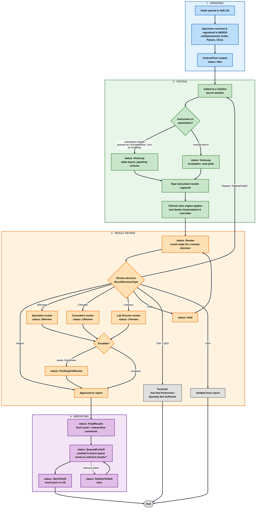
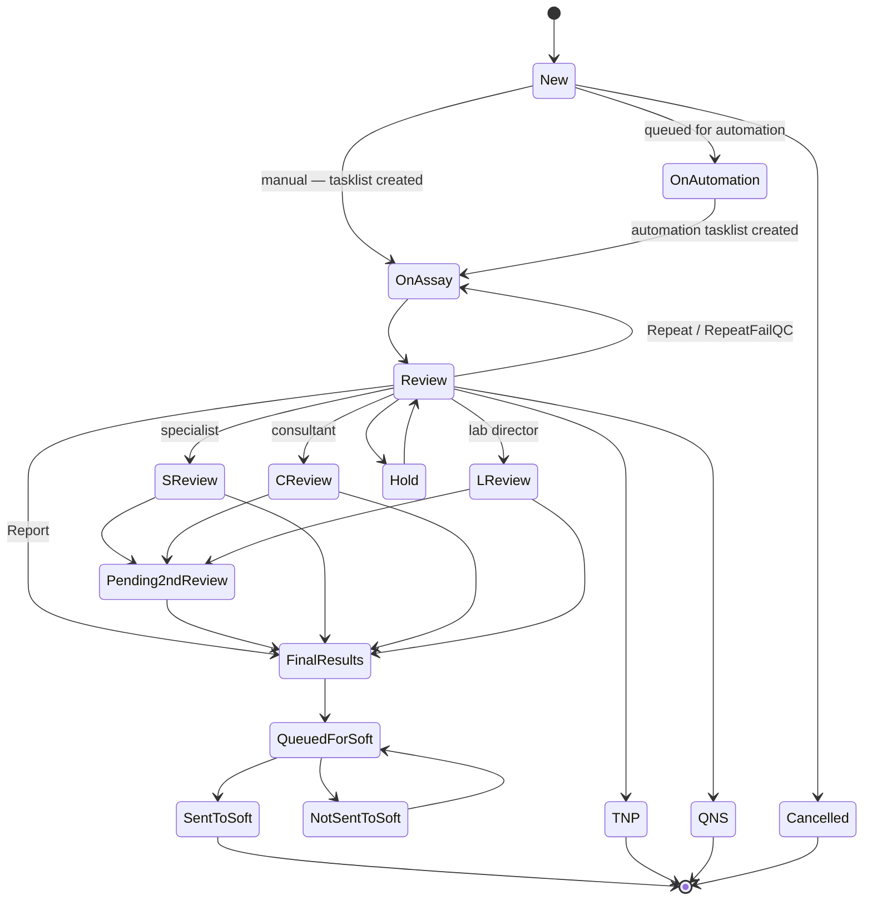

# Step 0 — NERDS Clinical Workflow (End-to-End)

This diagram shows the lifecycle a clinical sample goes through in NERDS, from arriving in the lab to the result being reported back to the LIS.

The stages map directly to the `WorkflowStatusType` enum (`model/WorkflowStatusType.java`) and the review outcomes map to the `ResultDecisionType` enum (`model/ResultDecisionType.java`) — so this isn't a generic picture, it's the actual state model in code.

> **Cross-checked against both repos.** This diagram was validated against **both** the backend (`NERDS_API`, Spring Boot) **and** the frontend (`NERDS_UI`, Angular 20 / NgRx at `/Users/lin.pengpeng/IdeaProjects/NERDS_UI`). The backend owns the *state model* (the status enums); the frontend provides the *screens* that drive each transition. Each stage below now lists the UI screen(s) as well as the API code. See **"The same workflow in the UI"** near the end for the frontend-specific findings — including one important gotcha: **the UI does not define its own status enum; it uses the backend's status strings as magic literals**, so the backend enum is the single source of truth.

> **Where to look to verify this yourself.** Backend `NERDS_API` — status model: `model/WorkflowStatusType.java`, `model/ResultDecisionType.java`, `model/ActionType.java`; ordering: `SoftServiceImpl` / `SoftController`, `controllers/SpecimenController.java`, `controllers/OfflineOrderController.java`; testing: `services/tasklist_steps/`, `controllers/TasklistController.java`; review: `controllers/AbstractReviewController.java` + `Specialist/Consultant/LabDirectorController`, `services/ReviewResultService.java`; reporting: `controllers/ReportsController.java`, `services/ReportingRulesService.java`, `services/NerdsQueueService.java`. Frontend `NERDS_UI` — `features/lab-dash/`, `features/sample/`, `features/testing/`, `features/{specialist,consultant,lab-director}/`, `features/reports/`, `state/`. (The **"How the diagram maps to the code (API + UI)"** table later in this file breaks this down stage by stage.)

---

## Where to start & how to read this

**The one sentence to hold in your head:** a physician orders a test → the lab physically runs it → a human reviews the result → the result is sent back. Everything below is detail hung on those four beats.

**The central object.** Follow the **`OrderedTest`** — *one test ordered on one specimen*. It is the thing that actually moves through the workflow. A single `Specimen` (tube of blood/CSF) can carry several `OrderedTest`s, and each one travels independently. The colored `status:` labels in the diagram are the `OrderedTest`'s `WorkflowStatusType` at each point — so "the workflow" is really "the life of one OrderedTest."

**How to read the diagram (do this in order):**
1. **Start at the top-left box** — `Order placed in Soft LIS`. That's the birth of the work. Read straight down.
2. **Follow the four colored bands top-to-bottom:** 🔵 Ordering → 🟢 Testing → 🟠 Review → 🟣 Reporting. Each band is one of the four beats above. An `OrderedTest` normally falls straight through them.
3. **Diamonds `{ }` are decision points** — the flow branches here. The two that matter most:
   - *"Instrument or automation?"* — splits the mechanical path (how the test is physically run). The two paths rejoin immediately; don't over-think it.
   - *"Review decision"* — this is the **heart of the whole system**. A human picks one `ResultDecisionType` and that single choice decides everything downstream: report it, repeat it, escalate it, or kill it.
4. **Watch the arrows that go *backwards or sideways*** — those are the interesting, non-obvious parts of the workflow:
   - `Repeat / RepeatFailQC` → loops **back up** to the Tasklist (the test is re-run from the bench).
   - `Hold` → parks the test, then returns it to Review later.
   - `S/C/L review` → an **escalation ladder** (Specialist → Consultant → Lab Director) before a result is trusted enough to report.
5. **Note the exits (`End` and terminal states).** Not every test produces a reportable result — `TNP`, `QNS`, `Cancelled` are true dead-ends. `Omit` looks like one on this diagram but actually resets the test to `New` in the real state model (see the correction near the state-machine section below) — it drops the *current result*, not the test itself. A test can leave the workflow without ever reaching Soft.

**A concrete happy path to anchor on** (the ~80% case, no escalation, no repeat):

> `New` → `OnAssay` (automation tests pass through `OnAutomation` first, as a queue) → *(rules run)* → `Review` → decision = **Report** → `FinalResults` → `QueuedForSoft` → `SentToSoft` → **done.**

Once that path feels obvious, every other arrow is just a *deviation* from it — a repeat, a hold, an escalation, or an early termination. Read the diagram as "the happy path, plus the ways reality complicates it."

**Then read the two diagrams in this order:**
- **Diagram 1 (flowchart)** — the *story*: what physically happens to a sample and who touches it. Best for building intuition.
- **Diagram 2 (state machine)** — the *rules*: exactly which `WorkflowStatusType` can transition to which. Best when you're writing code and need to know "can a test in state X legally move to state Y?"

---

## The big picture

> **Color legend:** 🔵 **blue** = Ordering · 🟢 **green** = Testing · 🟠 **orange** = Review · 🟣 **purple** = Reporting · ⚪ **grey** = terminal / end. The colors are now applied to each *box* (via `classDef`), not just the band background, so they show even in renderers that ignore subgraph fills. Terminal outcomes (`TNP/QNS`, `Omit`, `End`) are grey because they leave the workflow without producing a normal reported result.

### Node color map

| Band | Color | Nodes |
|---|---|---|
| Ordering | 🔵 blue | `A, B, C` |
| Testing | 🟢 green | `D, E, F, G, H, I` |
| Review | 🟠 orange | `J, K, S, CR, LR, HOLD, ESC, P2, REPORTOK` |
| Reporting | 🟣 purple | `FR, Q, SENT, NS` |
| Terminal/End | ⚪ grey | `TERM, OMIT, DONE` |

---

## Stage-by-stage walkthrough

Read this alongside the diagram — one section per colored band.

### 🔵 1 · Ordering — *the work is born*
A physician orders a test in the **Soft LIS** (the hospital's system of record). NERDS receives that order and registers the physical sample as a **`Specimen`** (keyed by `softSpecimenId`), attached to an **`Order`**, a **`Patient`**, and a **`Clinic`**. For each test requested, an **`OrderedTest`** is created in status **`New`** — this is the object you'll track through the rest of the flow.
- **Who acts:** the ordering physician (in Soft) → automatic intake into NERDS.
- **API code:** `SoftServiceImpl` / `SoftController` pull from Soft; `SpecimenController` (`/api/specimen`) manages the specimen; entities `Specimen`, `Order`, `OrderedTest`.
- **UI screens:** `lab-dash` feature — `LabDashComponent` with clinical/non-clinical order entry (`SingleOrderComponent`, `BatchOrderComponent`, and non-clinical variants); offline orders via `offline-order.service.ts` (`/api/offline-orders`); the specimen record itself lives in the `sample` feature (`SampleSpecimenComponent`, `SamplePatientComponent`).
- **Orders don't only come from Soft.** This diagram shows the *primary* path (order placed in Soft → API reads it), but NERDS can also **create orders in-app** ("offline" clinical add-on tests, and non-clinical research/LDT orders). For the three order origins, when each is used, and how they differ, see **[`order-origins.md`](order-origins.md)**.
- **What can go wrong here:** an order gets `Cancelled` before any work happens.

### 🟢 2 · Testing — *the lab physically runs the assay*
The `OrderedTest` is placed on a **Tasklist** (a bench worklist grouping many tests to run together). How it's physically executed splits two ways, but the split is purely mechanical — both paths rejoin at "raw results captured":
- **Automation-driven** — the automation system runs it (the test was first *queued* as `OnAutomation`, then runs as `OnAssay` once its tasklist is created); NERDS tracks the **plate layout** and **pipetting scheme** (which sample sits in which well).
- **Manual bench** — a tech runs it by hand (`OnAssay`), with steps like **incubation** and **read plate**.

  > **Note (corrected):** `OnAutomation` is the *"queued for the automation pipeline"* status, **not** "the robot is running the steps." Both automation- and human-driven tasklists run their steps under **`OnAssay`**. The driver (automation API vs UI) is a separate axis from the status — see [`testing-stage.md`](../testing-stage/testing-stage.md).

Once raw numbers come back, the **clinical rules engine** applies each test family's interpretation logic and any overrides (e.g. converting a raw titer into a reportable interpretation). This is where a lot of NERDS's domain intelligence lives.
- **Who acts:** lab technologists at the bench / instruments.
- **API code:** `TasklistController` + `tasklist_steps/`, `PlateLayout` / `PipettingScheme`, the `automation/` packages, `IncubationController`, `ReadPlateController`; interpretation in `services/rules/` + `application.yaml`.
- **UI screens:** the `testing` feature is the whole bench workflow — `TestingComponent` → a tasklist tree at `tasklist/:tasklistId` (`CoversheetComponent`, `LayoutComponent`, `ScheduleComponent`) with review children `ReadComponent` (read plate), `InitialResultsComponent`, `RepeatsComponent`, `CalculatedDataComponent` / `MultiTestCalculatedDataComponent`, `QcChartsComponent`, `SummaryComponent`, `CompleteTlComponent`. Automation/batch: `BatchTasklistComponent`, `CreateTasklistComponent`, `GatingReviewComponent`, `TakePhotoComponent`; `testing.service.ts` → `/api/automation/*`. NgRx state in `features/testing/store/` (`tasklist/`, `tasklist-plate/`, `tasklist-step/`).
- **Key idea:** the two mechanical paths don't change the workflow *state logic* — they both land in `Review`. In the UI this is where the `Repeat` / `Report` / `SReview` / `CReview` decision literals are set (e.g. `calculated-data.component.ts`, `complete-tl.component.ts`).

### 🟠 3 · Result Review — *a human decides what the result means*
This is the **decision core** of NERDS. The test lands in status **`Review`** and a qualified person makes exactly one call, captured as a **`ResultDecisionType`**:

| Decision | What it means | Where the test goes |
|---|---|---|
| **Report** | Result is trustworthy and reportable | → Reporting (`FinalResults`) |
| **Repeat / RepeatFailQC** | Re-run needed (bad QC, ambiguous) | → `New` → **back to the Tasklist** *(not a direct hop to `OnAssay` — see the correction below)* |
| **SReview** | Needs a **Specialist**'s eyes | → `SReview` |
| **CReview** | Needs a **Consultant** (physician) | → `CReview` |
| **LReview** | Needs the **Lab Director** | → `LReview` |
| **Hold** | Park it for now | → `Hold`, later back to `Review` |
| **TNP / QNS** | Test Not Performed / Quantity Not Sufficient | → terminal (no result) |
| **Omit** | Drop the current result | → `New` — **not truly terminal**; the test resets and can be picked up again |

The **S → C → L** path is an **escalation ladder** of increasing authority. Some results also require a **second independent reviewer** to confirm before finalizing — that's `Pending2ndReview`. Only once a decision resolves to *report* does the test leave this band.
- **Who acts:** technologists, then Specialists → Consultants → Lab Director as needed.
- **API code:** `ReviewController`, `SpecialistController`, `ConsultantController`, `LabDirectorController`, `IFATechReviewController`; the `ActionType` enum captures the interpretive-comment review-request/complete actions (`InterpCmt2ndReviewRequest`, `InterpCmtConsReviewRequest`, `InterpCmtLabDirReviewRequest`, …).
- **UI screens:** three role features — `specialist` (`SpecialistDashboardComponent`, `SpecialistPendingSamplesComponent`, `SpecialistSpecialistReviewsComponent`), `consultant` (`ConsultantDashboardComponent`, `ConsultantTasklistComponent`, IFA/prion/map1b review variants, `consultant-md/` Call-MD/Get-MD), and `lab-director` (`LabDirectorDashboardComponent`, `LabDirectorPendingSamplesComponent`). All three share one screen, `ReviewerSpecimenReviewComponent`, backed by one shared NgRx engine (`state/reviewer/`) whose generic `reviewerReducer` is instantiated per role. The **second review** is its own screen: `interpretive-comments/2nd-review` → `SecondReviewComponent`. Data service `reviewer.service.ts` switches between `/api/consultant`, `/api/specialist`, `/api/lab-director`.
- **Key idea:** most complexity in the whole diagram is *here*. If you understand the Review decision node, you understand NERDS. The UI confirms the three-tier ladder is real *and* shares one implementation — `state/reviewer/reviewer.actions.ts` maps the `[Consultant]` / `[Specialist]` / `[LabDirector]` action types straight to the `CReview` / `SReview` / `LReview` statuses.

### 🟣 4 · Reporting — *the result goes back to the LIS*
An approved result becomes **`FinalResults`** (final value + interpretive comments), then is **`QueuedForSoft`** — placed on an **Azure Storage queue** (`nerds-to-soft-test-results-*`). A separate process delivers it to Soft; success flips it to **`SentToSoft`**. If delivery fails it becomes **`NotSentToSoft`** and is retried.
- **Who acts:** mostly the system (asynchronous delivery); humans monitor and can re-send.
- **API code:** `ReportsController`, `ReportingRulesService`, the Azure queue (`NerdsToSoftTestResultsQueueName`); `AzureQueueService` / `NerdsQueueService`.
- **UI screens:** the `reports` feature (`ReportsComponent` → `PendingResultsComponent`, `InitialResultsComponent`; `reports.service.ts` → `/api/reports/*`). Delivery to Soft is **visible and actionable** in the UI: `soft-status/soft-status.component.ts` (route `lis-status/:resultFileId`) shows delivery state, and `SendToSoftRetryComponent` (`resend-to-lis`) lets a user retry a failed push — i.e. the `NotSentToSoft → QueuedForSoft` retry loop is a real button, not just a background job. Admin config lives under `admin/lis/reporting-rules`.
- **Key idea:** reporting is **asynchronous and retryable** — the queue decouples NERDS from Soft's availability. `SentToSoft` is the successful end of the road; `NotSentToSoft` surfaces to a human who can resend.

---

## The status lifecycle as a state machine

A tighter view of just the `WorkflowStatusType` transitions an `OrderedTest` moves through:

### How to read this diagram

This is a **state machine**, not a story. Each box is one value of the `WorkflowStatusType` enum — the *status an `OrderedTest` is currently in*. Each arrow is a **legal transition**: "a test in status X is allowed to move to status Y." The label on an arrow (when present) is the *trigger* — the decision or event that causes the move.

The difference from the flowchart above:
- The **flowchart** answers *"what happens to a sample, and who does it?"* — good for intuition.
- The **state machine** answers *"from this status, where is the test allowed to go next?"* — good when you're **writing code** and need to know whether a transition is valid, or what states a query/filter should include.

Read it like this:
- **`[*]` at the top** is the *start* (a brand-new `OrderedTest` comes into existence).
- **`[*]` at the bottom** is the *end* (the test has reached a terminal status and stops moving).
- Follow arrows out of a box to see every status it can legally become next. If two statuses have **no arrow between them, that transition is not allowed** — e.g. you can't jump straight from `New` to `SentToSoft`; a test must pass through testing, review, and finalization first.

### Walking the states

**Entry.** `[*] → New`. Every test starts in `New`. From `New` a test either goes straight to `OnAssay` (a tasklist is created manually) or first to `OnAutomation` (it's *queued for the automation pipeline*) and then to `OnAssay` when automation creates its tasklist — plus one escape hatch, `Cancelled`, if the order is pulled before any work is done. **Key point:** `OnAutomation` is a *staging/queue* status, **not** "the robot is running the steps"; the steps actually run under `OnAssay` regardless of who drives them (see [`testing-stage.md`](../testing-stage/testing-stage.md)).

**Testing.** Whether it arrived via the manual path (`New → OnAssay`) or the automation path (`New → OnAutomation → OnAssay`), the running tasklist sits in **`OnAssay`** and then moves to `Review`. Notice the state machine *collapses* the "raw results / rules engine" detail the flowchart showed — from a status point of view, running the assay simply moves the test from "on the bench" (`OnAssay`) to "ready for a human" (`Review`).

**Review — the hub.** `Review` is the busiest node; almost everything radiates from here. From `Review` a test can go to:
- `FinalResults` (label **Report**) — the happy path, straight to finalization.
- `SReview` / `CReview` / `LReview` — hand off to a Specialist / Consultant / Lab Director.
- `Hold` — park it.
- `OnAssay` (label **Repeat / RepeatFailQC**) — **the one backward transition**: send it back to be re-run. This is the loop that lets a test go around again.
- `TNP` / `QNS` — terminate with no result (Test Not Performed / Quantity Not Sufficient).

**The review sub-cycle.** `SReview`, `CReview`, and `LReview` each have two exits: straight to `FinalResults` (reviewer approves), or to `Pending2ndReview` (a second reviewer must confirm first). `Pending2ndReview → FinalResults` completes that confirmation. `Hold → Review` shows a parked test always comes *back* to the Review hub rather than skipping ahead — so nothing bypasses human review.

**Finalization & delivery.** `FinalResults → QueuedForSoft → SentToSoft` is the delivery pipeline. `QueuedForSoft ⇄ NotSentToSoft` is a **retry loop**: if the push to Soft fails, the test flips to `NotSentToSoft` and is re-queued, looping until it succeeds. This models the asynchronous, retryable nature of talking to the external LIS.

**Terminal states.** Four boxes flow to the bottom `[*]` and stop: `SentToSoft` (the normal success end), plus `TNP`, `QNS`, and `Cancelled` (the "no reportable result" ends). Once a test reaches any of these it does not move again.

### Two things the state machine makes obvious (that the flowchart doesn't)

1. **The legal "go backward" edges.** Only two arrows point *upstream*: `Review → OnAssay` (repeat) and `Hold → Review` (un-park), plus the `QueuedForSoft ⇄ NotSentToSoft` retry. Everything else flows strictly forward. If you're ever tempted to write code that moves a test backward some *other* way, the diagram says: that's not a modeled transition.
2. **Which statuses are "done."** The bottom `[*]` connects exactly to `SentToSoft`, `TNP`, `QNS`, `Cancelled`. This lines up with `WorkflowStatusType.updateable()` in code, which returns `false` for the terminal states (`SentToSoft`, `Cancelled`, `TNP`, `QNS`, `NonOrderedTest`) — i.e. the enum itself encodes "you may not edit a test once it's terminal." The diagram is a visual of that method.

> **Simplifications to be aware of:** this diagram shows the *common* transitions, not every conceivable one. A few real states are omitted for clarity — `OnAssay`/`OnAutomation` can also lead to `Hold`, and `NonOrderedTest` (a result for a test nobody ordered) sits outside the normal flow entirely. When in doubt, treat `WorkflowStatusType.java` as the source of truth and this diagram as the map.
>
> **Correction (found while researching the Review stage in detail):** the `Review → OnAssay: Repeat / RepeatFailQC` arrow is a simplification of two hops — `ReviewResultService.repeatTest()` actually sets the status to **`New`** (not directly `OnAssay`); it only becomes `OnAssay` again once a new tasklist is created from that `New` state, same as any other test. And **`Omit` is not a hard terminal state** — `ReviewResultService.omitResults()` marks the latest results `Indeterminate` and also resets the status to **`New`**, meaning the test can be picked up again rather than ending for good. See [`../review-stage/review-stage.md`](../review-stage/review-stage.md) for the full review-decision ladder these two belong to.

---

## How the diagram maps to the code (API + UI)

Each stage spans both repos: an Angular screen (`NERDS_UI`) calls an API endpoint (`NERDS_API`).

| Stage | Backend — `NERDS_API` | Frontend — `NERDS_UI` |
|---|---|---|
| **Ordering** — specimen intake from Soft LIS | `SoftServiceImpl` / `SoftController`, `SpecimenController` (`/api/specimen`); entities `Specimen`, `Order`, `OrderedTest` | `lab-dash` feature (`LabDashComponent`, single/batch order components), `offline-order.service.ts`, `sample` feature (specimen/patient records) |
| **Testing** — tasklists, plates, automation | `TasklistController` + `tasklist_steps/`, `PlateLayout` / `PipettingScheme`, `automation/` packages, `IncubationController`, `ReadPlateController` | `testing` feature — tasklist tree (`Coversheet`, `Layout`, `Schedule`, `Read`, `InitialResults`, `Repeats`, `CalculatedData`, `QcCharts`, `CompleteTl`); stores in `features/testing/store/` |
| **Rules / interpretation** | `services/rules/` (e.g. `MogFlowTiterRules`, `GadTitrationOverrideRules`) + `services/rules/test_family_rules/`, config in `application.yaml` | *(mostly backend)* — the UI just displays calculated/interpreted results; family-specific review components live under `consultant/` (IFA, prion, map1b, kelch11) |
| **Result review** (S/C/L review, 2nd review) | `ReviewController`, `SpecialistController`, `ConsultantController`, `LabDirectorController`, `IFATechReviewController`; decisions in `ResultDecisionType` | `specialist`, `consultant`, `lab-director` features sharing `ReviewerSpecimenReviewComponent`; shared NgRx `state/reviewer/`; second review = `interpretive-comments/2nd-review` (`SecondReviewComponent`); `reviewer.service.ts` |
| **Reporting → Soft** | `ReportsController`, `ReportingRulesService`, Azure queue (`NerdsToSoftTestResultsQueueName`); statuses `QueuedForSoft` / `SentToSoft` / `NotSentToSoft` | `reports` feature (`PendingResults`, `InitialResults`); `soft.service.ts` (`/api/soft`), `SoftStatusComponent` (`lis-status`), `SendToSoftRetryComponent` (`resend-to-lis`) |

### Key enums to read (the source of truth for this diagram)
- `model/WorkflowStatusType.java` — every box's `status:` label.
  - `isInProcessStatusTypes()` = `SReview, CReview, LReview, Hold` (the "in-flight review" states).
  - `updateable()` excludes the terminal states (`SentToSoft`, `Cancelled`, `TNP`, `QNS`, `NonOrderedTest`).
- `model/ResultDecisionType.java` — the branch labels out of the **Review** decision node (`Report`, `Repeat`, `RepeatFailQC`, `CReview`, `SReview`, `LReview`, `TNP`, `QNS`, `Hold`, `Omit`).

### Review roles (the three-tier escalation)
- **SReview** = Specialist review
- **CReview** = Consultant review
- **LReview** = Lab Director review
- **Pending2ndReview** = a second reviewer must confirm before the result is finalized

---

## The same workflow in the UI (frontend cross-check)

Findings from reading `NERDS_UI` (Angular 20, NgRx) and reconciling it with this diagram.

**1. The four bands are literally four groups of Angular features.** The workflow you see here maps onto the UI's top-level routes almost one-to-one:

| Band | UI route(s) / feature |
|---|---|
| 🔵 Ordering | `lab-dash` (order entry), `sample` (specimen record) |
| 🟢 Testing | `testing` (the tasklist tree) |
| 🟠 Review | `specialist`, `consultant`, `lab-director`, `interpretive-comments/2nd-review` |
| 🟣 Reporting | `reports`, plus `soft-status` / `resend-to-lis` screens |

Other routes (`search`, `inventory`, `admin`, `sample-monitoring`) are support/around-the-edges, not part of the core sample lifecycle.

**2. The three-tier review is confirmed — and it's one shared implementation.** Specialist, Consultant, and Lab Director all render the **same** `ReviewerSpecimenReviewComponent` and are backed by **one** generic NgRx reducer factory (`state/reviewer/`) instantiated three times. `reviewer.actions.ts` maps action types `[Specialist]` / `[Consultant]` / `[LabDirector]` directly to the `SReview` / `CReview` / `LReview` statuses in this diagram — strong confirmation the escalation ladder is exactly as drawn.

**3. The Soft retry loop is a real, human-facing feature.** The `QueuedForSoft ⇄ NotSentToSoft` loop in the state machine isn't just a background job — the UI has a `SoftStatusComponent` (`lis-status/:resultFileId`) to see delivery status and a `SendToSoftRetryComponent` (`resend-to-lis`) to re-send. So a failed delivery surfaces to a person who clicks "resend."

**4. ⚠️ Gotcha — the UI has no status enum; statuses are magic strings.** The backend's `WorkflowStatusType` / `ResultDecisionType` are the **single source of truth**. The UI does *not* define a mirroring enum — `workflowStatus` is typed as plain `string`, and values like `'SReview'`, `'Report'`, `'QueuedForSoft'` appear as string literals scattered across components (e.g. `calculated-data.component.ts`, `complete-tl.component.ts`, `ifa-review.business.ts`). **Implication:** if you rename or add a `WorkflowStatusType` on the backend, nothing in the UI will fail to compile — you must grep the UI for the literal and update it by hand. This is a real drift risk to keep in mind when changing workflow states.

**5. Versioning.** `NERDS_UI` `package.json` = `nerds-ui` **1.20.0**; `NERDS_API` `pom.xml` = **1.19.1**. The two are *intended* to move in lockstep (see `CLAUDE.md`); at the time of writing the UI is one minor ahead — normal mid-development skew, but worth confirming they're aligned at release.

> **What's still backend-only in this diagram:** the *rules/interpretation* step (🟢 Testing) is almost entirely server-side — the UI just displays the calculated result. Everything else has a clear UI counterpart above.

---

> **Tip:** viewing this file in an editor with Mermaid support (IntelliJ with the Mermaid plugin, VS Code with a Mermaid extension, or GitHub/Azure DevOps preview) will render the diagrams. Otherwise paste into <https://mermaid.live>.
