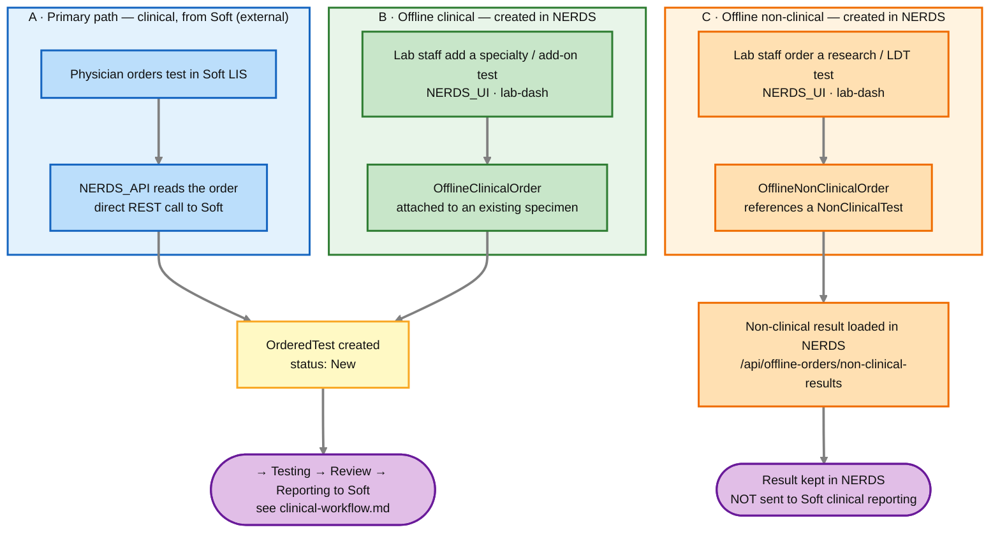

# Step 0 — Where orders come from (Soft vs. in-app "offline" ordering)

The main [`clinical-workflow.md`](clinical-workflow.md) diagram shows orders originating in **Soft** (the hospital LIS) and NERDS reading them. That's the *primary* path — but it's not the only way an order enters NERDS. The app can also **create orders itself**, a capability the code calls **"offline orders."** This page explains the three origins, *when* you'd use each, and how they differ.

> **"Offline" = entered directly in NERDS, not received through the Soft interface.** It has nothing to do with network connectivity.

> **Cross-checked against both repos.** Where to look to verify this yourself — Backend `NERDS_API`: `controllers/OfflineOrderController.java` (`/api/offline-orders`), `services/OfflineOrderService.java`; entities `model/OfflineClinicalOrder.java`, `model/OfflineNonClinicalOrder.java`, `model/NonClinicalTest.java` (+ `Specimen` / `Order` / `OrderedTest`); the Soft-origin path `SoftServiceImpl` / `SoftController`; config `application.yaml` → `offline-order.nerds-tests-ordered-as-group`. Frontend `NERDS_UI`: `features/lab-dash/` (single/batch clinical + non-clinical order components), `shared/services/offline-order.service.ts`. (A fuller **"How this maps to the code"** section is at the end of this file.)

---

## The three ways an order can enter NERDS

**How to read it:** three origins on top, each in its own colored lane. Notice where they **converge** and where they **don't**:
- **A (primary)** and **B (offline clinical)** both funnel into the same **`OrderedTest → status: New`**, then follow the exact workflow in [`clinical-workflow.md`](clinical-workflow.md) (testing → review → results back to Soft). They are two doors into the *same* room.
- **C (offline non-clinical)** is a **separate track** — it does *not* create a standard `OrderedTest` and its result is **not** reported back to Soft; it's handled inside NERDS.

---

## When would you actually use offline ordering?

### B · Offline **clinical** ordering — "add a specialty/add-on test to a specimen we already have"

This creates real clinical `OrderedTest`s (they run through the normal tasklist → review → report-to-Soft flow), but the *order* is entered by lab staff in NERDS instead of arriving from Soft. Typical situations:

- **Specialty neuroimmunology assays the lab drives.** The config `offline-order.nerds-tests-ordered-as-group` lists exactly these — `AEM CBA, MATK 0.5 IFA, MATK IFA Titration, Custom8, NIF CBA`. These are specialized cell-based assays / IFA titrations that the lab adds itself. *(This is direct evidence from `application.yaml`.)*
- **Add-on / reflex testing.** A result on an existing specimen indicates further testing is warranted, so the lab adds the follow-up test to that same specimen — without a new physician order round-trip through Soft. *(Inference, supported by the fact that offline clinical orders attach to an **existing** `specimenId`.)*
- **Manual/fallback entry.** A clinical test needs to be on the specimen but didn't come across the Soft interface (e.g. a test not orderable in Soft, or an interface hiccup). *(Reasonable inference — treat the exact policy as the lab's, but the capability clearly exists.)*

**Key constraint:** offline clinical orders require an **existing specimen** (`specimenId`). So there's still a specimen (usually created from a Soft order); offline clinical ordering *adds tests to it*, it doesn't originate a patient/specimen from scratch.

### C · Offline **non-clinical** ordering — "run something that isn't a reportable patient result"

`NonClinicalTest` is a catalog of named tests with no patient/Soft linkage, and `OfflineNonClinicalOrder` carries a `developer` field, `followUpInstructions`, and its **own** result type (`OfflineNonClinicalTestResult`). That shape points squarely at **work that isn't clinical patient reporting**:

- **Research / method development** — trying an assay outside routine clinical use (the `developer` field is the tell).
- **Lab-developed test (LDT) validation / verification** — running specimens to validate a new or modified assay before it goes clinical.
- **QC / studies** — non-patient runs whose results shouldn't flow into a patient's clinical report.

**Key difference:** because it's *not* a clinical result, it **never goes back to Soft** through the results queue. Results are loaded and kept in NERDS (`/api/offline-orders/non-clinical-results`). This is why lane C dead-ends inside NERDS in the diagram.

---

## Side-by-side comparison

| Aspect | A · Primary (from Soft) | B · Offline clinical | C · Offline non-clinical |
|---|---|---|---|
| **Who initiates the order** | Ordering physician (in Soft) | Lab staff (in NERDS) | Lab staff (in NERDS) |
| **Where the order is created** | Soft LIS | NERDS `lab-dash` UI | NERDS `lab-dash` UI |
| **Comes from the Soft interface?** | ✅ yes (NERDS reads it) | ❌ no | ❌ no |
| **Needs an existing specimen?** | creates/represents one | ✅ yes (adds to existing) | ✅ yes (`specimenId`) |
| **Creates a standard `OrderedTest`?** | ✅ yes | ✅ yes | ❌ no (own result type) |
| **Runs the tasklist → review flow?** | ✅ yes | ✅ yes | separate/lighter handling |
| **Result destination** | back to **Soft** (via queue) | back to **Soft** (via queue) | **stays in NERDS** |
| **Typical use** | routine clinical testing | specialty/add-on clinical assays (CBA, IFA titrations), reflex/manual adds | research, LDT validation, QC |
| **Code** | `SoftServiceImpl` / `SoftController` | `OfflineOrderController` `/clinical`, `OfflineClinicalOrder` | `OfflineOrderController` `/non-clinical`, `OfflineNonClinicalOrder`, `NonClinicalTest` |

**The mental model in one line:** *Soft-originated* and *offline-clinical* orders are two doors into the **same** clinical workflow (and both report back to Soft); *offline non-clinical* orders are a **separate** in-house track that never touches Soft.

---

## How this maps to the code

- **Controller:** `controllers/OfflineOrderController.java` (`/api/offline-orders`) — `/clinical` (list, upsert, batch), `/non-clinical` (add, edit, delete, batch), `/non-clinical-results` (load results), `lab-dash-ordered-test-names`.
- **Service:** `services/OfflineOrderService.java`.
- **Entities:** `model/OfflineClinicalOrder.java` (has `List<OrderedTest>`, `requestedByLanId`, `testingInstructions`), `model/OfflineNonClinicalOrder.java` (has `nonClinicalTestId`, `developer`, `OfflineNonClinicalTestResult`), `model/NonClinicalTest.java`.
- **Config:** `application.yaml` → `offline-order.nerds-tests-ordered-as-group`.
- **UI:** `NERDS_UI` `features/lab-dash/` — `SingleOrderComponent` / `BatchOrderComponent` (clinical) and non-clinical variants; `offline-order.service.ts`.

> **Accuracy note:** the *existence* of the three paths, the entity shapes, the Soft-vs-NERDS result destinations, and the specialty-assay list are all from the code. The specific *business reasons* for choosing offline clinical entry (reflex vs. manual-fallback vs. specialty) are reasonable inferences from the data model and config — the lab's actual operating policy is the authority on exactly when each is used.
