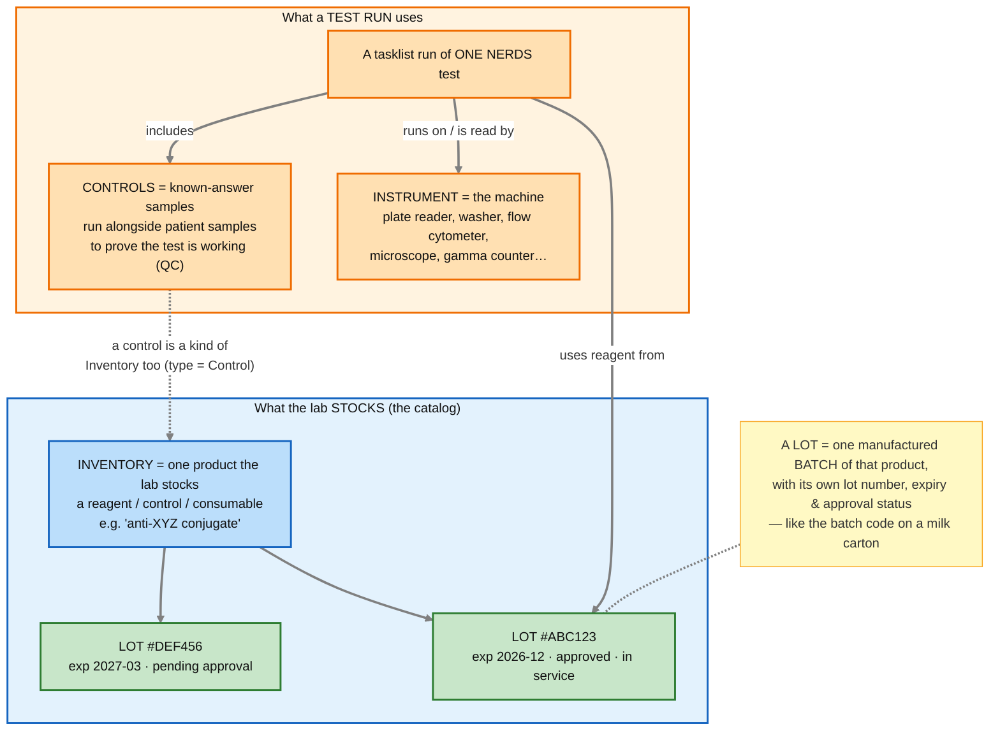
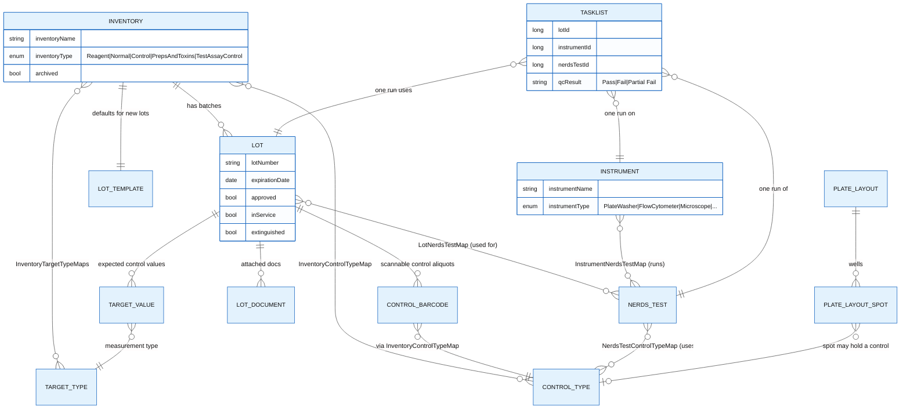
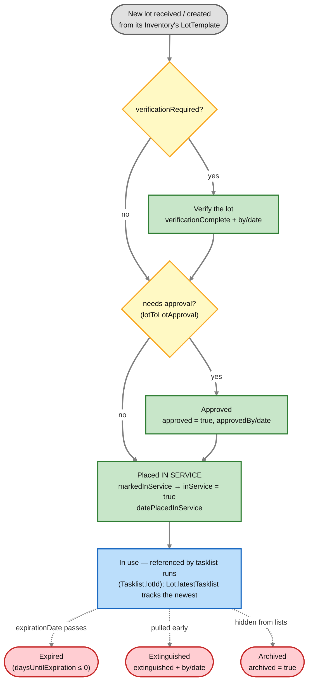
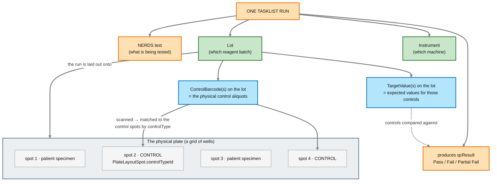

# Step 0 — Materials & QC: Lot, Inventory, Control, Instrument

The workflow docs keep mentioning **lot**, **control**, and **instrument** without explaining them. This file defines each in plain language, shows how they relate, and shows how they show up in an actual test run. Start here if "lot" (or "control", or "target value") feels fuzzy.

> **Cross-checked against both repos.** Where to look to verify this yourself — Backend `NERDS_API`: `model/Inventory.java`, `model/InventoryType.java`, `model/Lot.java`, `model/LotTemplate.java`, `model/LotNerdsTestMap.java`, `model/InventoryControlTypeMap.java`, `model/ControlType.java`, `model/ControlBarcode.java`, `model/TargetValue.java`, `model/TargetType.java`, `model/Instrument.java`, `model/InstrumentType.java`, `model/InstrumentNerdsTestMap.java`, `model/ControlRule.java`, `model/QcResultType.java`, and the tie-ins in `model/Tasklist.java` / `model/PlateLayoutSpot.java` / `model/NerdsTest.java`; controllers `LotController`, `LotTemplateController`, `InventoryController`, `admin/AdminInstrumentController`, `admin/ControlRuleController`, `documents/LotDocumentController`. Frontend `NERDS_UI`: `features/inventory/` (reagents, controls, normals, lot history/info), `features/specialist/lot-approvals/`.

---

## The five words, in one breath

- **Inventory** — a *product the lab stocks* (a reagent, a control material, a consumable). The catalog entry. e.g. "anti-XYZ conjugate."
- **Lot** — *one manufactured batch* of an Inventory product, with its own **lot number**, **expiration date**, and approval/QC status. Like the batch code on a milk carton: same product, one particular run. **One Inventory → many Lots.**
- **Control** — a sample with a *known expected result*, run alongside patient samples to prove the assay is working. (A control material is itself an Inventory of type `Control`, with its own Lots.)
- **Instrument** — the *machine* that runs or reads the test (plate reader, washer, flow cytometer, microscope…).
- **Target value** — the *expected value* for a control, recorded per Lot — the number QC checks the control against.

That's the whole vocabulary. The rest of this file is just those five things and how they connect.

> **Common question: "are lots the things in the inventory, with tracking numbers?"** Almost — with one refinement. **Inventory is the *product* (one catalog entry), not a count of units on hand.** That product *has many lots* (batches), and each lot is identified by its **lot number** (a batch identifier, like a food batch/best-by code — not a per-unit serial number). So it's **product → batches**, not "a bin of individually-numbered units." Also note this model tracks a lot's **identity, expiry, and approval — not quantity remaining** (there's no "units on hand" field). *(The other "number-like" thing is a `ControlBarcode`: a scannable code for a physical control aliquot from a lot — see Diagram 4.)*

---

## Diagram 1 — The concept (plain language first)



### How to read it
- **Top blue band = the catalog** (what the lab keeps on the shelf): each **Inventory** product has one or more **Lots** (batches). The two lots under one inventory are the same product from different manufacturing runs — different lot numbers, different expiry, independent approval status.
- **Bottom orange band = a single test run**: it draws reagent from a specific **Lot**, runs on an **Instrument**, and includes **Controls**.
- **The dashed arrow from Controls back up to Inventory** makes one key point: even though a control *looks* like its own separate thing down in the test run, **a control is really just another Inventory item** (one whose type is `Control`). So it's stocked, batched into **lots**, and given an expiry/approval **exactly like a reagent** — there's no separate system for controls. In other words, everything the top band says about `Inventory → Lot` applies to controls too; that's why the arrow loops back up.

**One-line takeaway:** *Inventory is the product, a Lot is a dated batch of that product, and a test run pulls a Lot + an Instrument + Controls together.*

---

## Diagram 2 — The real entity relationships (ER)

Once the concept is clear, here's how the model actually wires together (cardinality: `||` = one, `o{` = many).



### How to read it

> **First, about the boxes:** every box is one table/entity. **A few show an attribute list (`INVENTORY`, `LOT`, `INSTRUMENT`, `TASKLIST`); the rest show only a name.** That's a *readability choice, not a real difference* — in a Mermaid ER diagram an entity only shows fields if you spell them out, so I only did it for the four "star" entities whose columns you actually need. **The name-only boxes still have columns** (mostly an id, a name, and foreign keys) — I just left them off to avoid clutter; their key fields are in the reference table lower down. Read a name-only box as "this entity exists and connects here," and look to the relationships (the lines) for its role.

Now read **every** relationship as a sentence, grouped by what they hang off of. (Cardinality: `||`=one, `o{`=many, `o|`=zero-or-one; `}o--o{` = many-to-many via a join table.)

**Inventory (the product) connects to —**
- **`INVENTORY ||--o{ LOT`** — one product has **many Lots** (batches). *The core relationship of this whole page.*
- **`INVENTORY ||--|| LOT_TEMPLATE`** — one product has **exactly one LotTemplate** (the rules for creating new lots — deep-dive below).
- **`INVENTORY }o--o{ CONTROL_TYPE`** — which **control kinds** apply to this product (join `InventoryControlTypeMap`, which also carries a `specimenType`).
- **`INVENTORY }o--o{ TARGET_TYPE`** — which **measurement types** this product is expected to have target values for (join `InventoryTargetTypeMaps`).

**Lot (a batch) connects to —**
- **`LOT ||--o{ CONTROL_BARCODE`** — the **scannable physical control aliquots** on this batch.
- **`LOT ||--o{ TARGET_VALUE`** — the **concrete expected values** for this batch's controls (what QC compares against).
- **`LOT ||--o{ LOT_DOCUMENT`** — attached **documents** (e.g. manufacturer certificates).
- **`LOT }o--o{ NERDS_TEST`** — which **tests this lot is used for** (join `LotNerdsTestMap`).

**Control / target detail —**
- **`CONTROL_BARCODE }o--|| CONTROL_TYPE`** — each barcode resolves to a **control kind** (through the `InventoryControlTypeMap`).
- **`TARGET_VALUE }o--|| TARGET_TYPE`** — each expected value is of a given **measurement type**.

**Tests ↔ instruments ↔ controls —**
- **`INSTRUMENT }o--o{ NERDS_TEST`** — which **machines can run which tests** (join `InstrumentNerdsTestMap`).
- **`NERDS_TEST }o--o{ CONTROL_TYPE`** — which **control kinds a test uses** (join `NerdsTestControlTypeMap`).

**The tasklist run (bridge to the workflow you already know) —**
- **`TASKLIST }o--|| LOT`**, **`}o--|| INSTRUMENT`**, **`}o--|| NERDS_TEST`** — **one run = one test × one Lot × one Instrument**, producing a `qcResult`.

**The plate layout —**
- **`PLATE_LAYOUT ||--o{ PLATE_LAYOUT_SPOT`** — a layout is a set of **wells/spots**.
- **`PLATE_LAYOUT_SPOT }o--o| CONTROL_TYPE`** — a spot **may** be designated a control (of some control kind); a spot with *no* control type is a **patient well**.

*(All the `}o--o{` links are many-to-many join tables whose names follow the `XMap` convention: `InventoryControlTypeMap`, `LotNerdsTestMap`, `InstrumentNerdsTestMap`, `NerdsTestControlTypeMap`.)*

### Inventory vs. LotTemplate — what's the difference?

Quick answer: **Inventory is the product. LotTemplate is the pre-filled form used when creating a new Lot for that product.**

They share the **same primary key** (`inventoryId`) because every product can have one matching template. That can feel odd at first, but it does **not** mean they are the same concept. It means the product record is split across two tables:

| Table | Simple meaning | What it answers |
|---|---|---|
| **Inventory** | The stocked product itself | "What is this thing?" |
| **LotTemplate** | The defaults for future batches of that product | "When a new batch arrives, what should the new Lot start with?" |
| **Lot** | One actual physical/manufactured batch | "Which batch are we using today?" |

Put another way:

- **Inventory = product identity.** It has the product's name (`inventoryName`), product type (`inventoryType`: Reagent/Control/Normal/...), archived flag, and product-level links to **ControlType**s and **TargetType**s. It is also the parent record that actual **Lots** belong to.
- **LotTemplate = lot creation recipe.** It has defaults that get copied into a new Lot: expiration timing (`daysToExpiration`, warning/critical windows), approval rules (`lotToLotApproval`), verification rules (`manualEntryVerification`), default tests (`nerdsTestIds`), linked lots (`linkedLotIds`), barcode templates, lot parameter templates, and a template note.

### Concrete example

Say the lab stocks a reagent called **"Anti-XYZ conjugate."**

The **Inventory** record says:

- name: `Anti-XYZ conjugate`
- type: `Reagent`
- this product is active/not archived
- this product is associated with certain control types and target types

The **LotTemplate** record for that same `inventoryId` says:

- new lots for this product expire after 180 days
- new lots require lot-to-lot approval
- new lots require manual entry verification
- new lots start with these default tests, barcodes, and lot parameters

Then, when the lab receives a **real physical batch** of that product, the manufacturer usually has a lot number printed on the bottle, package, or certificate. In this example, pretend that printed lot number is **ABC123**. The app creates an actual **Lot** under that Inventory for that specific batch. The Lot gets its concrete lot number, expiration date, approval state, verification state, barcodes, and target values.

So the flow is:

```text
Inventory: "Anti-XYZ conjugate" product
        +
LotTemplate: defaults for new Anti-XYZ batches
        |
        v
Lot: actual physical batch with printed lot number ABC123
```

**Analogy:** Inventory is the product's **catalog page**. LotTemplate is the saved **"new batch" form** for that product. Lot is the filled-out form for one actual batch/container the lab received.

One code clue: `LotTemplateController`'s `new-lot/{inventoryId}` path uses the template to scaffold a new Lot. It is not returning the template as the Lot; it is using the template to pre-fill a fresh Lot.

**Two accuracy notes baked into the model (worth knowing):**
1. **`ControlRange` is dead code** — the file is entirely commented out. Do *not* look for Westgard mean/SD ranges there; per-lot expected values live in **`TargetValue`**.
2. **`ControlRule` is a separate thing from the above** — it's a *result-flagging* rule attached to a `Test`/`SpecimenType` (Westgard-style operators on results), **not** a range attached to a Lot or ControlType. It's about "flag this patient result as interesting," not "is this control in range." It's included here only so you don't confuse it with control *ranges*.

---

## Diagram 3 — A lot's lifecycle

"What is a lot" is clearest when you watch one move through its life.



### How to read it
A lot is *born from its Inventory's LotTemplate* (which supplies the defaults), then passes through up to two gates — **verification** and **approval** — before it can be **placed in service**. Only an in-service, unexpired, approved lot should be used in a real run — which is exactly what the "lot requirement" check in `testing-stage.md` enforces, and overriding it (e.g. using an expired lot anyway) is the "lot override → escalate to Specialist review" from `review-stage.md`.

The three dashed exits are how a lot leaves use: **Expired** (time ran out), **Extinguished** (pulled early — used up or found bad), **Archived** (hidden from active lists). These line up with `SpecimenMatrixIdStatusType`'s themes but are tracked by the boolean/date fields on `Lot` directly (there's no single `LotStatus` enum — the state is derived from `approved` / `inService` / `extinguished` / `archived` / `expirationDate`, much like the step-state pattern in `testing-stage.md`).

---

## Diagram 4 — How lot / instrument / control show up in a real run

This connects the materials back to the tasklist you already understand.



### How to read it

**The shape of the diagram:** the box at the top-left, **`ONE TASKLIST RUN`**, is the thing everything hangs off. The four arrows going *right* from it are the run's four facets (what/with-what/on-what/result). The arrows going *down* from **`Lot`** show that the lot is the piece that ties the *physical plate* and its *controls* together. So read it as: "a run has a test, a lot, an instrument, and a result — and the lot is what furnishes the plate's controls."

**Walk it piece by piece:**

1. **`ONE TASKLIST RUN → NERDS test / Lot / Instrument`** — a run is defined by three foreign keys on `Tasklist`: `nerdsTestId` (**what** is being tested), `lotId` (**with which** reagent batch), `instrumentId` (**on which** machine). That's the whole "identity" of a run. (This is the same trio from Diagram 2's `TASKLIST }o--|| …` lines — here it's shown as an actual run.)

2. **`→ produces qcResult`** — after the run, the tasklist carries a `qcResult` of **Pass / Fail / Partial Fail**. This is the *quality-control verdict for the whole run* (did the controls behave?), separate from any individual patient's result. It's what "Control/QC Review" in `review-stage.md` checks.

3. **`Lot → The physical plate`** — a plate is a **grid of wells**, modeled as a `PlateLayout` made of `PlateLayoutSpot`s. The single most important thing here: **a spot either is a control or is a patient specimen**, decided by one field:
   - `PlateLayoutSpot.controlTypeId` **is set** → that well is a **control well** (spots 2 & 4 in the diagram).
   - `controlTypeId` **is null** → that well is a **patient specimen** (spots 1 & 3).
   So the layout is a map of "which wells hold controls vs. patients." The controls aren't a separate thing off to the side — they occupy real wells on the same plate as the patients.

4. **`Lot → ControlBarcode(s) → the control spots`** — where do the *physical* controls come from? From the **lot**. Each control aliquot on the lot has a scannable **`ControlBarcode`**. When the tech scans a control's barcode, NERDS looks up its **control type** (via the lot) and matches it to the plate spot that was designated for that control type. That's the dashed "scanned → matched by controlType" arrow: it's how a physical tube of control gets tied to the right well.

5. **`Lot → TargetValue(s) ⇢ qcResult`** — the lot also carries the **expected values** for its controls (`TargetValue`s — see Diagram 2). During the run, the controls' *actual* readings are compared against these *expected* values; if the controls read within expectations the run's `qcResult` is Pass, otherwise Fail/Partial Fail. That comparison is the essence of QC.

**A concrete example.** Say you run test *ARBI* using reagent **Lot #ABC123** on the **plate reader**:
- The plate layout puts a **negative control** in well 2 and a **positive control** in well 4; wells 1 and 3 hold two patient specimens.
- The tech scans the negative-control tube (a `ControlBarcode` from Lot #ABC123); NERDS sees its control type is "negative" and lines it up with well 2. Same for the positive control → well 4.
- After reading, the control wells' numbers are checked against Lot #ABC123's `TargetValue`s. If both controls are in range → the run's `qcResult` = **Pass**, and the patient results (wells 1 & 3) can be trusted and go on to interpretation/review. If a control is out of range → **Fail**, and the patient results on that plate aren't trustworthy.

**One-line takeaway:** *the lot is the hub of QC — it provides both the physical controls (via barcodes, placed on designated plate spots) and the expected values (target values) they're judged against; the run's pass/fail verdict falls out of that comparison.*

---

## Quick reference — the whole domain in a table

| Term | Plain meaning | Key code | Belongs to / relates to |
|---|---|---|---|
| **Inventory** | A product the lab stocks | `model/Inventory.java` | has many **Lots**; has one **LotTemplate**; maps to **ControlType**s & **TargetType**s |
| **InventoryType** | The kind of product | `model/InventoryType.java` | `Reagent, Normal, Control, PrepsAndToxins, TestAssayControl` |
| **Lot** | One dated batch of an Inventory product | `model/Lot.java` | belongs to an **Inventory**; has **ControlBarcode**s, **TargetValue**s, **LotDocument**s; maps to **NerdsTest**s |
| **LotTemplate** | Defaults/rules for making new lots | `model/LotTemplate.java` | one per **Inventory** |
| **Control** | A known-answer QC sample | (an Inventory of type `Control`) + `ControlType` | placed on plate spots; aliquots = **ControlBarcode**s |
| **ControlType** | The *kind* of control | `model/ControlType.java` | mapped to Inventory & NerdsTest; set on **PlateLayoutSpot** |
| **ControlBarcode** | A scannable physical control aliquot | `model/ControlBarcode.java` | belongs to a **Lot** |
| **TargetValue** | Expected value for a control, per lot | `model/TargetValue.java` | belongs to a **Lot**; typed by **TargetType** |
| **Instrument** | The machine that runs/reads a test | `model/Instrument.java` | maps to **NerdsTest**s; set on **Tasklist** & **TasklistStep** |
| **InstrumentType** | The kind of machine | `model/InstrumentType.java` | `PlateWasher, FlowCytometer, Microscope, GammaCounter, …` |
| **qcResult** | The run's QC outcome | `model/QcResultType.java` | `Pass / Fail / Partial Fail`, on **Tasklist** |
| **ControlRule** | A result-*flagging* rule (not a range!) | `model/ControlRule.java` | attached to a **Test** / **SpecimenType** |

---

## Honest limits

1. **`ControlRange` is not a live entity** — the class is fully commented out. Per-lot expected values are **`TargetValue`**; there's no separate Westgard mean/SD range table.
2. **"Control" is overloaded.** It's (a) an `InventoryType`, (b) a `ControlType` (the *kind*), (c) a `ControlBarcode` (a physical aliquot on a lot), and (d) a spot on a plate (`PlateLayoutSpot.controlTypeId`). Diagram 4 shows how they line up; don't assume "control" always means the same object.
3. **No single `LotStatus` enum** — a lot's state (verified / approved / in-service / expired / extinguished / archived) is *derived* from several boolean/date fields on `Lot`, the same "state from fields, not an enum" pattern documented for steps in `testing-stage.md`.
4. **QC gating detail is elsewhere.** *How* a `qcResult` is computed and *when* QC review can complete (it must round-trip ODM at least once) live in `review-stage.md` and the `ReviewService` QC methods — this file covers the *materials*, not the QC-review workflow.

> See also: [`../testing-stage/testing-stage.md`](../testing-stage/testing-stage.md) (lots/instruments as step requirements, controls on plates) and [`../review-stage/review-stage.md`](../review-stage/review-stage.md) (QC review, the "lot override → Specialist review" escalation).
