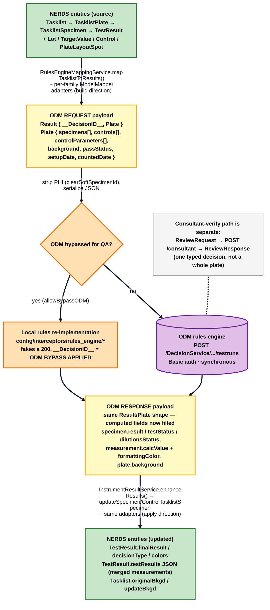
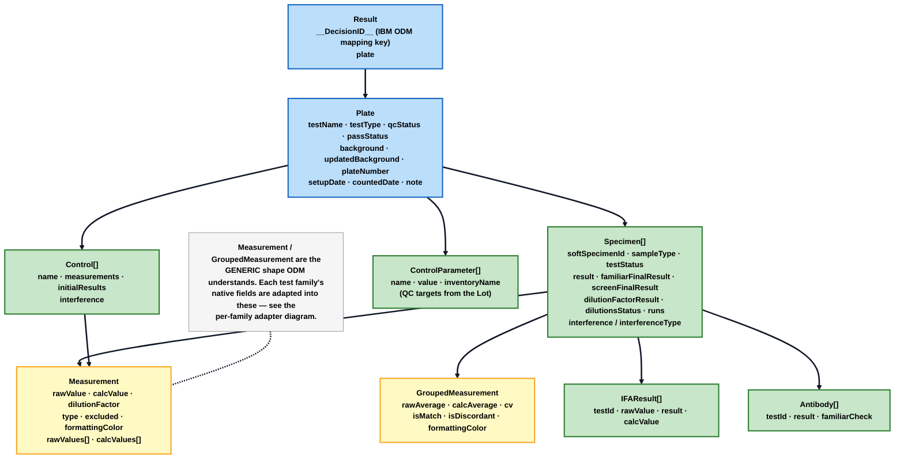
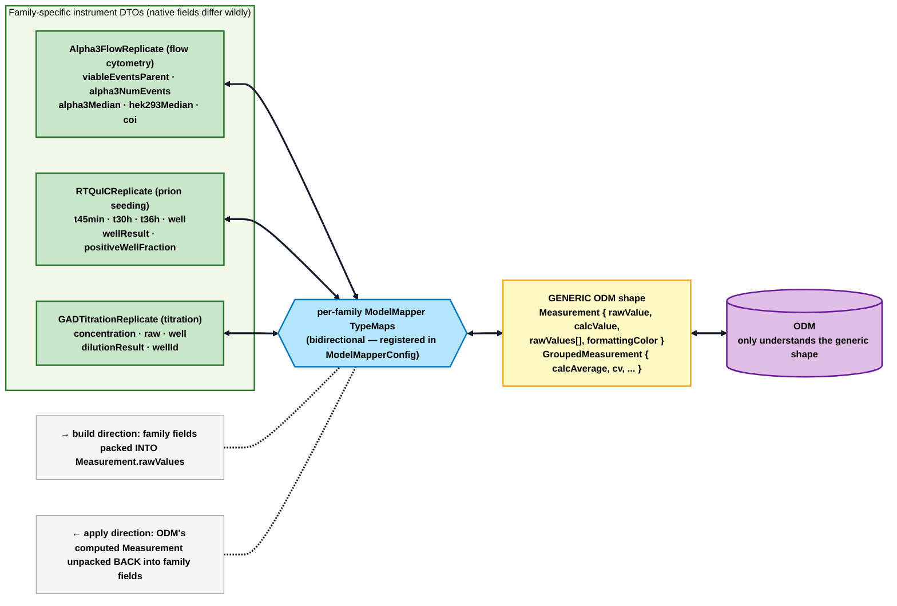
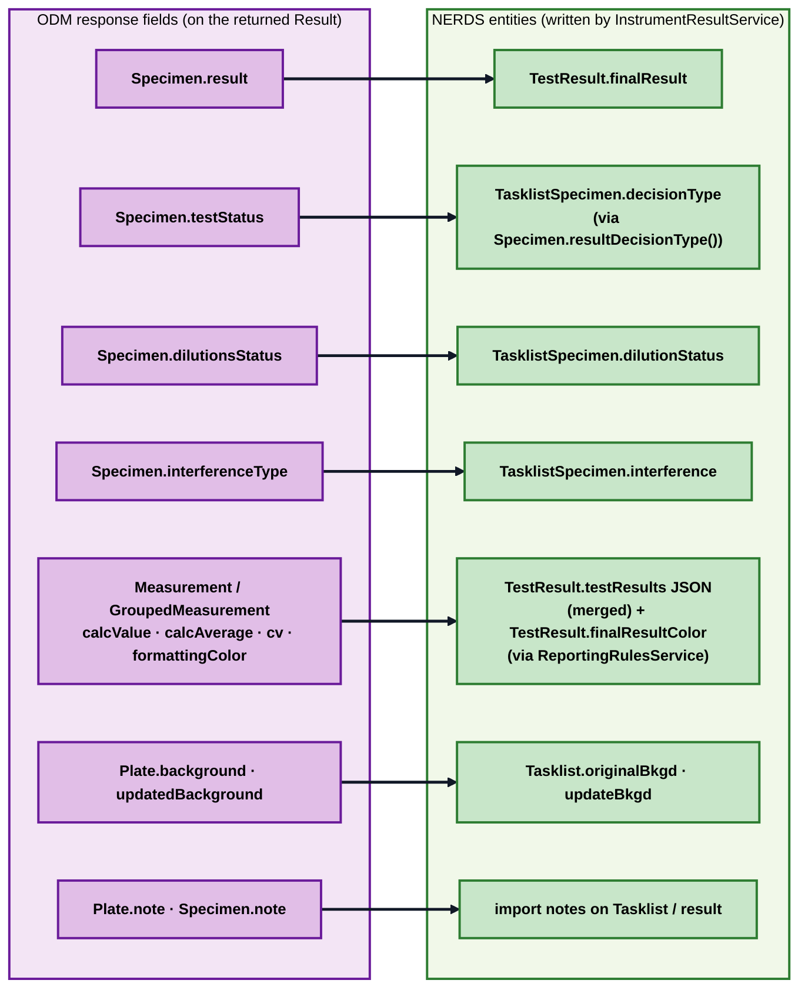
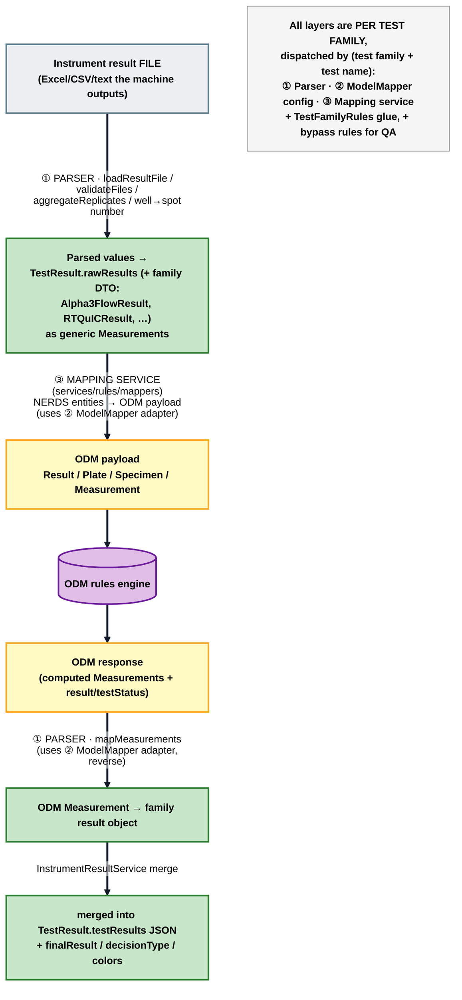

# Step 0 — ODM payload mapping: how NERDS talks to the rules engine

`review-stage.md` explains *when* ODM is called and *why*. This companion explains *how* the data is shaped: how NERDS **packages** its own entities into a payload ODM can process, and how it **maps ODM's answer back** onto its entities — and why that mapping is done **per test family** (which is what all those `*ResultModelMapperConfig` classes are for).

> **Cross-checked against both repos.** Where to look to verify this yourself — Backend `NERDS_API`: `repositories/RulesEngineRepository.java` (HTTP + payload envelope + ODM XML error parsing), `services/RulesEngineService.java`, `controllers/ResultsController.java` (all payload DTOs — `Result`/`Plate`/`Specimen`/`Control`/`Measurement`/`GroupedMeasurement`/`IFAResult`/`Antibody` are inner classes here), `services/rules/mappers/` (`RulesEngineMappingService`, `TasklistMappingService`, `TasklistPlateMappingService`, `TasklistSpecimensMappingService`, `RelatedTasklistMappingService`), `services/rules/contexts/RulesContext.java` (per-family dispatch), `services/rules/test_family_rules/*`, `config/instrument_results/*ResultModelMapperConfig.java` + `config/ModelMapperConfig.java` (TypeMap registration ~lines 695–701), `config/interceptors/rules_engine/*` (QA-bypass local rules), `services/InstrumentResultService.java` (`enhanceResults`, `updateSpecimenTasklistSpecimen`, `setDecision`, `mergeTestResults`), `application.yaml` lines ~414–424 (`rules.api.urls`). Frontend: not involved — this is entirely a server-side NERDS↔ODM concern (the UI just clicks "Send to ODM").

---

## The one big idea

**NERDS and ODM don't share a data model, so every call is a *translation* in and a *translation* out.** NERDS' internal world is `Tasklist → TasklistPlate → TasklistSpecimen → TestResult`. ODM's world is a flat `Result → Plate → Specimen/Control → Measurement`. A **mapping layer** (`services/rules/mappers/`) converts NERDS → ODM on the way in, and `InstrumentResultService` converts ODM → NERDS on the way back. In the middle, because each assay's instrument produces wildly different numbers, a **per-test-family adapter** packs each family's native fields into ODM's one generic shape (and unpacks them again on return).

Five things to hold onto:
1. **The envelope is tiny and fixed:** `Result { __DecisionID__, Plate }`. `__DecisionID__` is IBM ODM's decision-service routing key — without it ODM rejects the call.
2. **The generic currency is `Measurement` / `GroupedMeasurement`.** ODM only understands those; every family adapts to/from them.
3. **The adapter is bidirectional and per-family** — the same `TypeMap`s are used to build the request *and* to apply the response.
4. **ODM computes; NERDS records.** ODM fills in `result`, `testStatus`, colors, background; `InstrumentResultService` writes those back onto `TestResult`/`TasklistSpecimen`/`Tasklist`.
5. **Before any of that, a *parser* reads the raw instrument file** into those measurements — and helps map ODM's answer back. Parsers are a separate per-family layer (Diagram 5) — this is the part people mean when they say "parsers are involved in ODM mapping."

---

## Diagram 1 — The round trip with its mapping layers

### How to read it
Follow it top to bottom — it's a there-and-back with a translation at each edge:
- **Down the left edge label** is the *build* step (`RulesEngineMappingService.mapTasklistToResults`): walk the tasklist's plates and specimens, and for each, use the family adapter to produce ODM's generic `Measurement`s. Just before sending, **PHI is stripped** (`clearSoftSpecimenId`) because ODM traffic is logged to App Insights.
- **The diamond** is the QA bypass: if `allowBypassODM` is on, a local re-implementation (`config/interceptors/rules_engine/*`) fakes ODM's answer so automated tests don't need a live ODM. Downstream code can't tell the difference.
- **The response** comes back in the *exact same shape*, just with the computed fields now filled (result, testStatus, colors, background).
- **The bottom edge label** is the *apply* step (`InstrumentResultService.enhanceResults`): the same family adapters run in reverse, and the computed values are written back onto NERDS entities (Diagram 4).

**Takeaway:** the shape that goes out is identical to the shape that comes back — ODM *decorates* the payload rather than returning a different structure. The mapping work is all NERDS↔generic-shape.

---

## Diagram 2 — The request payload shape (what ODM receives)

All these classes are inner classes of `controllers/ResultsController.java`.

### How to read it
It's a nested tree: **one `Result` wraps one `Plate`; a `Plate` holds many `Specimen`s and `Control`s; each of those holds many `Measurement`s** (individual well readings) and `GroupedMeasurement`s (replicate averages/CVs). A few things worth noticing:
- **Controls and Specimens are the same shape** (both implement `SpecOrCtrl`) — a control is just a specimen with a known expected value; its expected values ride along as `ControlParameter`s (pulled from the Lot's `TargetValue`s — see `materials-qc/`).
- **`Specimen` carries a lot of cross-tasklist context** (`familiarFinalResult`, `screenFinalResult`, `relatedTestFinalResult`) — that's what `RelatedTasklistMappingService` enriches before the payload is built, so ODM's rules can compare against prior/related results.
- **The `Measurement`/`GroupedMeasurement` boxes are the generic denominator** — the next diagram shows how each family's native fields get in and out of them.

---

## Diagram 3 — Why mapping is *per test family* (the adapter)

### How to read it
This is the answer to *"why are there a dozen `*ResultModelMapperConfig` classes?"* — because **each assay's instrument speaks a different dialect**, but ODM only speaks one (`Measurement`). Each family config is an **adapter** registered as a **bidirectional** ModelMapper `TypeMap` (`config/ModelMapperConfig.createModelMapper()` wires them all in). The three examples show how different the dialects are:

| Family | What its numbers actually are | How it maps into the generic `Measurement` |
|---|---|---|
| **Alpha3 Flow** (flow cytometry) | cell-population medians & event counts across channels | those channels (`alpha3Median`, `hek293Median`, `viableEventsParent`, …) are packed into `Measurement.rawValues[]`; `calcValue` ← titer or concentration |
| **RT-QuIC** (prion seeding) | kinetic time-to-threshold points + positive-well fraction | `t45min`/`t30h`/`t36h`/`well` into `rawValues[]`; `calcAverage` ← `positiveWellFraction`; *no CV or concentration at all* |
| **GAD Titration** | dilution results & concentrations | `calcValue` ← `concentration`; `rawValue` ← `raw`; grouped `calcAverage` ← `dilutionResult` |

**Same `TypeMap`, both directions:** on the way *out*, the family DTO's fields are packed into `Measurement`; on the way *back*, ODM's computed `Measurement` is unpacked into the family DTO (e.g. `setAlpha3Median`, `setPositiveWellFraction`). That's why the configs each declare four TypeMaps (`FamilyResult ↔ GroupedMeasurement`, `FamilyReplicate ↔ Measurement`).

Also note **screen vs titration split within a family** (Gen5 → `Gen5ScreenResult` vs `Gen5TiterResult`; GAD → screen rules vs titration rules): even the "same" family maps differently depending on whether it's a screening run or a titration run — which is why dispatch happens by *test name*, not just family.

---

## Diagram 4 — How ODM's answer is written back onto NERDS entities

### How to read it
Each arrow is one field-level write performed by `InstrumentResultService.updateSpecimenTasklistSpecimen` (and its control twin). The important conceptual points:
- **`Specimen.testStatus` (a string) → `TasklistSpecimen.decisionType`** goes through `Specimen.resultDecisionType()`, which translates ODM's status strings (`Complete`/`Report`→`Report`, `CReview`→`CReview`, `Pending`/`Repeat`→`Repeat`, …) into the `ResultDecisionType` enum. This is the exact value that determines *where the result goes next* in the decision ladder (Diagram 2 of `review-stage.md`).
- **The measurements don't overwrite — they're *merged*** into `TestResult.testResults` (a JSON blob), with nulls stripped so ODM's partial answer doesn't clobber existing DB values (`mergeTestResults` → `MapUtils.merge`).
- **The reported *color* is computed separately** by `ReportingRulesService.runReportingRules(...)`, then possibly overridden by a grouped-measurement `formattingColor` from the merge.
- **`decisionTypeBy` is set to `"NERDS"`** on these writes (not a person) — so in the audit trail you can tell a decision came from the rules engine vs. a human reviewer.

---

## Diagram 5 — The parser layer (where "parsers" fit in)

Everything above starts from *measurements*. But those measurements don't appear from nowhere — a **parser** reads them out of the raw instrument file first. Parsers are a separate per-family layer (`constraints/instrument_results/`), and they're the "parsers are involved in ODM mapping" you may have heard about.

### What a parser is
`constraints/instrument_results/InstrumentResultParser<T>` is a per-family interface; `InstrumentResultParsers` is a registry that hands you the right one via `getParser(testFamily, nerdsTestName)` (there are ~20 — `Gen5Parser`, `Alpha3FlowScreenParser`/`Alpha3FlowTitrationParser`, `RTQuICParser`, `StableFlowParser`, `ModulatingFlowParser`, `TransientFlowParser`, `GADParser`/`GADTitrationParser`, `AptivaParser`, `GangliosidesScreen/TiterParser`, `ZincParser`, `MagParser`, `Ma2Parser`, `GammaCounterParser`, `BCAParser`, `GQ1BParser`, Euroline `MyositisIBParser`/`ParaneoplasticIBParser`). Its key methods:

- **`loadResultFile(...)`** → `(countedDate, rows, controlParameters)` — the core job: **read the instrument's raw file** into structured rows. Each instrument writes a different file format, so this is inherently per-family.
- **`validateFiles(...)`**, **`getFilename(...)`**, **`matchPlateNumber(...)`**, **`getFilesForBlobStorage(...)`** — figure out which uploaded file is which plate, and archive them to blob storage.
- **`aggregateReplicates(...)` / `aggregateReplicatesById(...)`** — combine replicate wells into grouped measurements (the averages/CVs).
- **`getOverallSpotNumber(...)` / `calcSpotNumber(...)`** — translate a well label (e.g. "A1") into the plate spot number, so results line up with the plate layout.
- **`mapMeasurements(groupedMeasurements, measurements)`** → the **return-trip** job: take ODM's computed generic measurements and produce the family result object that gets merged into `TestResult.testResults`.

So a parser bookends the ODM trip: it produces the measurements *before* (from the file) and consumes ODM's measurements *after* (`mapMeasurements`).

### The per-family layers, side by side (this is the confusing part)
There are **several** per-family things with similar names. Here's what each is, so you don't conflate them:

| Layer | Package | What it does | Direction |
|---|---|---|---|
| **① Parser** (`*Parser`) | `constraints/instrument_results/` | Reads the raw instrument **file** into rows/measurements; maps ODM measurements **back** (`mapMeasurements`) | file ↔ measurements |
| **② ModelMapper config** (`*ResultModelMapperConfig` / `*MappingConfig`) | `config/instrument_results/` | The bidirectional `TypeMap`s: family DTO ↔ generic `Measurement` (Diagram 3) | both |
| **③ Mapping service** (`*MappingService`) | `services/rules/mappers/` | NERDS **entities** ↔ ODM **payload** (`Plate`/`Specimen`) — the request build & response apply orchestration | both |
| **TestFamilyRules** (`*Rules`) | `services/rules/test_family_rules/` | Per-family glue that ties parser output + the ModelMapper together (`getMeasurements`, `mapRulesEngineResults`) | both |
| **Bypass rules** (`*Rules`) | `config/interceptors/rules_engine/` | A *local re-implementation* of ODM's decision logic, used only when ODM is bypassed for QA | n/a |

The quick way to tell them apart: **Parser touches *files*; ModelMapper config touches *DTO fields*; Mapping service touches *NERDS entities*; TestFamilyRules is the glue; the interceptor rules are the QA stand-in for ODM itself.** (Watch out: e.g. there are two classes literally named `Map1bRules` — the bypass one in `config/interceptors/rules_engine/` and the glue one in `services/rules/test_family_rules/`.)

---

## Honest limits

1. **"ODM = IBM ODM" is inferred**, not stated in code — from `bpm.ibmcloud.com`, the `/DecisionService/rest/...` URL shape, and the `__DecisionID__` field. High confidence, not certain.
2. **Auth is Basic, and only for the IBM Cloud host.** `RulesEngineRepository.addRulesServiceHeaders()` adds `Base64(user:password)` *only when* the base URL contains `bpm.ibmcloud.com`; the shared bearer-token interceptor deliberately has **no** branch for the ODM URL (a code comment even asks "will be used by ODM?"). So a non-IBM-Cloud ODM host would currently go unauthenticated through this path — worth verifying against the deployed config.
3. **`evaluate` and `zinc` endpoints are configured but not wired** into `RulesEngineRepository` — only `testruns` (assay) and `consultant` (reviewer verify) are used there. Zinc has its own family handling.
4. **A real dispatch gotcha:** in `RulesContext.getTestFamilyRules`, the GAD case only handles the exact names `"GAD Screen"` / `"GAD Titration"`; any other GAD name falls through to `default` and throws. So GAD mapping is name-exact, not family-wide.
5. **This is the *measurement-based* path.** IFA / Aptiva and other "no-measurement" families take a parallel route (`TestFamilyRules.mapRulesEngineResults`, e.g. `AptivaRules.mergeTestResults` matching `IFAResult.testId`) rather than the `Measurement` merge — the shapes differ, though the round-trip idea is the same.

> See also: [`worked-example-alpha3-flow.md`](worked-example-alpha3-flow.md) (this whole pipeline traced on **one real specimen** with numbers — and what "translate" / "enhance results" mean), [`review-stage.md`](review-stage.md) (Diagram 3 — the ODM round trip at the *call* level; this file is the *data* level), and [`../materials-qc/materials-qc.md`](../materials-qc/materials-qc.md) (where `ControlParameter`/`TargetValue` come from).
