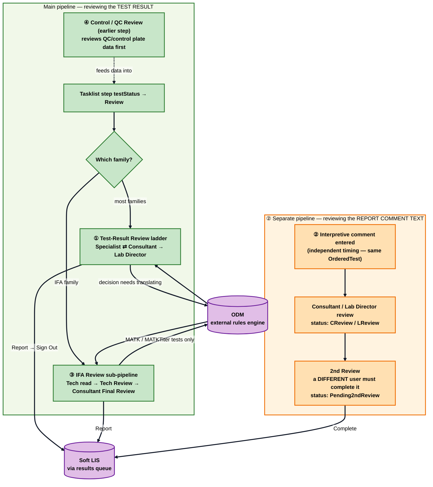
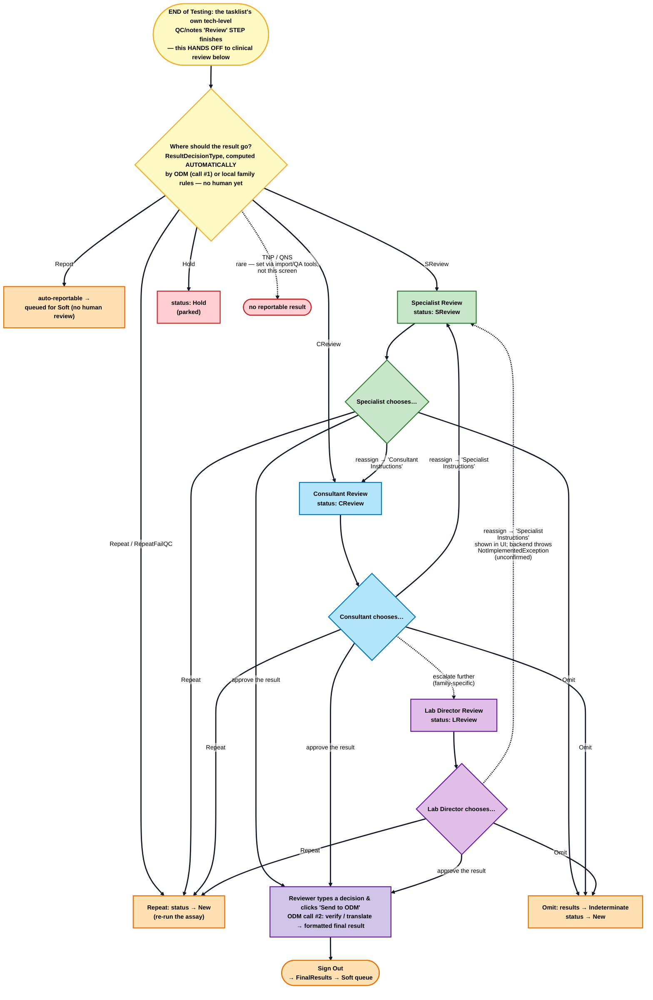
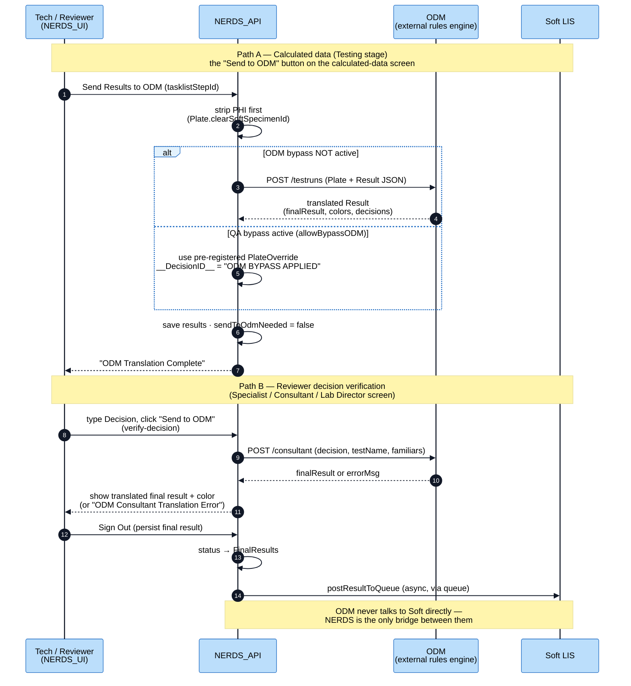
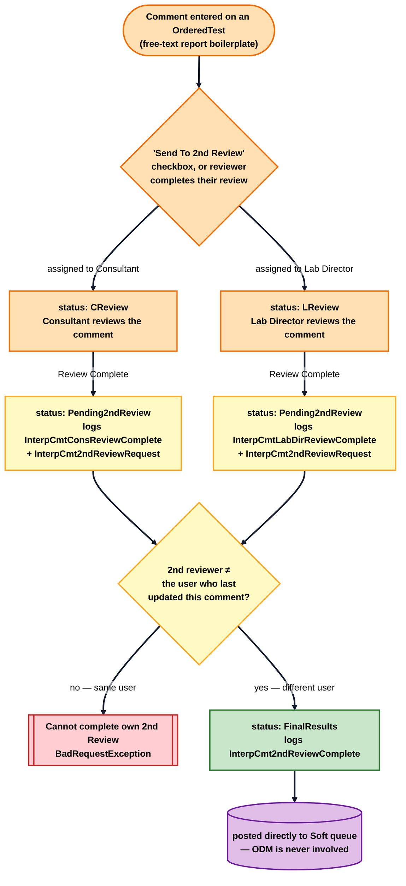
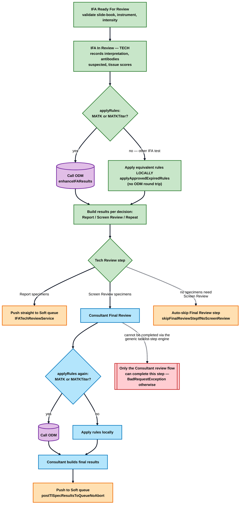
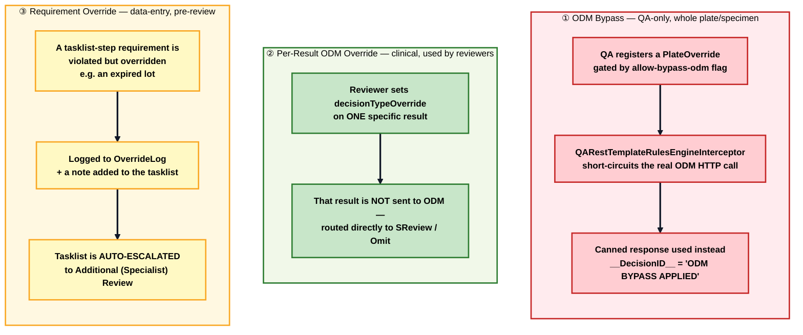

# Step 0 — The Review Stage in Detail (Specialist / Consultant / Lab Director & ODM)

In `clinical-workflow.md`, "Review" is one orange band with a decision diamond. In reality it's **four separate pipelines** that share vocabulary (`SReview`/`CReview`/`LReview`) but work quite differently — plus an external system, **ODM**, that most people assume is part of "sending to Soft" but actually isn't. This file zooms in.

> **Cross-checked against both repos.** Backend: `NERDS_API` (`controllers/AbstractReviewController.java` + `Specialist/Consultant/LabDirectorController`, `services/ReviewResultService.java`, `repositories/RulesEngineRepository.java`, `services/tasklist_steps/IFA*Service.java`, `model/OverrideLog.java`). Frontend: `NERDS_UI` (`shared/components/reviewer/`, `state/reviewer/`, `shared/components/bypass-odm/`, `shared/components/odm-override/`, `features/interpretive-comments/2nd-review/`).

---

## The one big idea

**"Review" is not one workflow.** Four things are all called "review," and they don't share code, screens, or even always the same destination system:

1. **Test-result review** — the Specialist ⇄ Consultant → Lab Director escalation ladder. This is what most people mean by "Review." Ends with a `Report` decision → **Sign Out** → Soft.
2. **Interpretive-comment review** — a *completely separate* pipeline reviewing the free-text report boilerplate on an `OrderedTest`, with its own two-tier + mandatory "2nd review" cycle. Runs on its own clock, independent of the test-result review. Feeds Soft directly — **never touches ODM**.
3. **IFA-specific review** — a specialization of pipeline ①, baked into the tasklist step engine for the IFA test family only (tech read → tech review → consultant final review), with extra ODM/Soft-push logic per step.
4. **Control/QC review** — an *earlier*, separate tasklist step that reviews the plate's QC/control data, before specimen results even get combined for the "real" review.

And weaving through ① and ③ is **ODM** — an external rules/decision engine, entirely separate from Soft, that translates raw numbers or a reviewer's typed decision into a formatted final result.

> **Term primer (read this before the diagrams):**
> - **ODM** — an external business-rules engine NERDS calls over HTTP. The acronym is never spelled out anywhere in either codebase; strong infrastructure fingerprints (a check for `bpm.ibmcloud.com`, a `/DecisionService/rest/NERDS/1.0/...` URL shape, and a required `__DecisionID__` field) point to **IBM Operational Decision Manager**. High confidence, not 100% certified by an explicit string in the code.
> - **Sign Out** — the action that persists a reviewer's final result and (if reportable) posts it to the Soft queue. Always the *last* step of a review decision.
> - **Verify Decision** ("Send to ODM" on the reviewer screen) — a *preview* call: send a typed decision to ODM, get back a formatted final result, **before** signing out. Two different calls, always in that order.
> - **Pending2ndReview** — a `WorkflowStatusType` used *only* by the interpretive-comment pipeline (②), not by test-result review.
> - **OverrideLog** — a generic audit-log entity for overriding a *data requirement* (e.g. an expired lot) at tasklist-step time — unrelated to ODM or to a reviewer's clinical decision.
> - **Lot** — a specific **batch** of a lab material (reagent/control/consumable) from one manufacturing run, with a unique lot number and its own expiration/approval status (like a milk carton's batch code). It comes up here because overriding an **expired or unapproved lot** during testing is one of the things that auto-escalates a tasklist into Specialist review (Diagram 6, ③).

---

## Diagram 1 — The four pipelines and how ODM/Soft fit in

### How to read it

**Two boxes, not one.** The green band (test-result review) and the orange band (interpretive-comment review) are drawn side by side deliberately — they run on the **same `OrderedTest`** but on **independent timelines**. A comment can be entered, reviewed, and sent to Soft while the test result itself is still sitting in Specialist review, or vice versa. Don't assume they're sequential steps of one pipeline.

Walk it left to right, top to bottom:
1. **Control Review (dashed arrow, green band)** happens *before* the main hand-off — it reviews the plate's QC/control data, separate from any specific patient result.
2. **The family fork** — most test families go through the plain **Test-Result Review ladder**; the **IFA family** runs a specialized version of the same idea (Diagram 5).
3. **ODM (purple)** sits *between* a decision and its finalization for **① Test-Result Review** and **③ IFA Review** — never for **② interpretive-comment review** and never called by **④ Control/QC Review**. *(The ①–④ badges on the boxes match the four-pipeline list in "The one big idea" above: ① = the green Test-Result Review ladder, ② = the orange comment-review band, ③ = the green IFA sub-pipeline, ④ = the green Control/QC Review box.)*
4. **Soft (purple)** is the common destination for all three "real result" tracks — but notice **ODM never points to Soft**. NERDS is the only thing that talks to both.

**The one thing to remember:** if someone says "the result is stuck in review," ask *which* review — a comment awaiting 2nd review and a test result awaiting Consultant sign-off are two unrelated queues.

---

## Diagram 2 — The Specialist / Consultant / Lab Director decision ladder

### How to read it

**First, clear up two words that appear twice and mean different things here** — this is the source of most confusion:

**"Review" appears twice.** The **start box** is *not* the review this diagram is about. It's the tasklist's own **tech-level "Review" *step*** (checking QC/notes) finishing at the *end of Testing* — see `testing-stage.md`, where the step engine's last step has `testStatus = Review`. When that step completes, it doesn't end anything; it **hands the result off** to the **clinical result review** (Specialist/Consultant/Lab Director) that this whole diagram describes. So read the start box as *"Testing just finished — clinical review begins now,"* not *"review is over."* Two different reviews, back to back: a **tech** step, then a **clinician** ladder.

**"ODM" appears twice** (this is the other confusion). ODM is called at **two separate moments**, and both are now shown:
- **ODM call #1 — automatic, at the top (yellow `ROUTE` diamond).** *Before any human*, ODM (or a family's local rules) computes a `ResultDecisionType` that decides *where the result goes* — straight to Soft (`Report`), or to a human reviewer (`SReview`/`CReview`), or `Repeat`/`Hold`. This is **not** a button anyone clicks.
- **ODM call #2 — reviewer-triggered (purple `Send to ODM` box near the bottom).** *If* a human reviewer gets the result and decides to approve it, **they** type a decision and click "Send to ODM," which asks ODM to translate their typed text into a formatted final result. *Then* they Sign Out.

So the order in the diagram is correct and matches the text: ODM #1 happens first (routing), *then* a human may act, *then* ODM #2 happens (verify) only if they approve. Same external system, two different calls, at two different times. (Diagram 3 shows both ODM calls in full detail.)

**The colored `…chooses…` diamonds** (green/blue/purple) are the **actual buttons** each reviewer sees on the shared reviewer screen: **approve** (→ type a decision → *Send to ODM* → Sign Out), **Repeat**, **Omit**, or **Reassign** ("… Instructions"). There is **no dropdown of canned values** (Positive/Negative/etc.) — the reviewer types the decision as free text, and ODM (#2) turns it into the formatted final result.

**Walk the ladder:**
- **Specialist ⇄ Consultant reassignment is symmetric and confirmed both ways** — a Specialist can send to Consultant ("Consultant Instructions") and a Consultant can send back to Specialist ("Specialist Instructions"). Both hit real, distinct backend endpoints (`.../creview`, `.../sreview`).
- **Escalating to Lab Director** is one-directional in the backend design — `LabDirectorController`'s note-subtype hooks (used for the reassignment machinery) explicitly `throw new NotImplementedException(...)`, and the class-level comment states Lab Director "doesn't reassign the way S/C do." **The dashed arrow back from Lab Director to Specialist is what the *UI* offers (it shows a "Specialist Instructions" option on the Lab Director screen) — but I could not confirm the backend actually supports it without hitting that exception.** Treat this one arrow as unverified; everything else in this diagram is confirmed from both sides.
- **`Repeat` and `Omit` both set the workflow status to `New`** — *not* directly to `OnAssay`, and `Omit` is *not* a hard terminal state (it clears the latest results to `Indeterminate` and returns the test to `New`). This refines the simplified `Review → OnAssay: Repeat` arrow in `clinical-workflow.md`'s state machine — see the note added there.
- **`TNP`/`QNS`** exist as formal `ResultDecisionType` values but were **not found anywhere in the shared reviewer screen's action set** — they're set through other paths (Excel/bulk result import, QA tooling), which is why they're drawn as a dashed, "rare" branch.
- **Sign Out is always the final, separate step** — never skip straight from "type a decision" to "reported." See Diagram 3 for exactly what happens in between.

---

## Diagram 3 — The ODM round trip (the "Send to ODM" button, in detail)

### How to read it

This is a **sequence diagram** (see `system-architecture.md` for the notation primer if you need it) with two independent paths, both labeled with a `Note`.

> **What is "calculated data"?** When an instrument runs a plate, it emits **raw readings** — numbers per well (optical density, counts, signal intensity, plus a *background*/blank reading). Those raw numbers aren't the answer yet. **Calculated data** = the raw readings after NERDS processes them into meaningful per-specimen values — most importantly **background subtraction** (each specimen's signal minus the plate's background/blank), and comparison against the controls on the plate. The tech reviews these computed values on a screen literally called the **"Calculated Data" tab** (`CalculatedDataComponent`; a `TasklistPlate` row is "a row on the calculated data tab" in the code). So "calculated data" ≠ raw instrument output and ≠ the final reported result — it's the **middle layer**: *processed numbers, not yet interpreted into Report/Repeat/etc.* Turning those processed numbers into a *decision* is exactly what "Send to ODM" does next.
>
> *(The `updateBkgd` value you'll see in the code and in Path A is the background used in that subtraction — a tech can adjust it and re-send; `Tasklist.originalBkgd` / `updateBkgd` store it, and it's applied across the run's plates. `enhanceResults` in `InstrumentResultService` is the method that packages the calculated data and sends it to ODM.)*

**Path A — "Send to ODM" on the calculated-data screen (Testing stage).** This is about *translating the calculated per-specimen numbers* into formatted, interpreted results (Report / Repeat / SReview / …). Before anything is sent, NERDS strips the specimen's Soft ID (`clearSoftSpecimenId`) — a PHI-safety step, because ODM traffic can be logged/monitored (Azure App Insights) and Soft IDs count as PHI. The `alt` block shows the **QA bypass**: if `allowBypassODM` is on and QA has pre-registered a canned response, the interceptor never makes the real HTTP call — it substitutes the canned data and stamps a recognizable marker (`__DecisionID__ = "ODM BYPASS APPLIED"`) so it's obvious in logs that this run didn't hit live ODM.

**Path B — "Send to ODM" on the reviewer screen.** This is a *different* endpoint (`/consultant`, not `/testruns`) with a different purpose: verify a **reviewer-typed** decision before committing it. Notice the reviewer takes **two separate actions**: first "Send to ODM" (a preview — nothing is saved yet), then **Sign Out** (the actual commit, which is what triggers `FinalResults` and the Soft queue post).

> **Want the *data-level* detail?** This diagram is the *call* level (who calls ODM, when). For **how the data is actually packaged into the ODM payload and mapped back** — and why there are a dozen per-test-family `*ResultModelMapperConfig` classes — see [`odm-payload-mapping.md`](odm-payload-mapping.md).

**The single most important thing this diagram shows:** the **last arrow in Path A goes back to the User, not to Soft** — and even in Path B, **ODM never appears again after `Sign Out`.** ODM's entire job is translation/decisioning; getting a result to Soft is a completely separate, NERDS-internal step (the queue post), confirmed by the closing note. If you're debugging "why didn't this result reach Soft," ODM being healthy or unhealthy is irrelevant *after* a decision has already been finalized — look at the queue/`NERDS_FUNCTIONS` path instead (see `system-architecture.md`'s specimen round-trip).

---

## Diagram 4 — Interpretive-comment review & the mandatory 2nd review

### How to read it

This is the state machine hiding behind `OrderedTest.updateICWfStatus(...)` — a small `switch` in the model class that both moves the status *and* writes an audit-trail `ActionType` entry in the same call, so every transition is dual-purpose (state change + log entry). Read the arrows top to bottom:

1. **Entry is dual.** A comment reaches `CReview`/`LReview` either explicitly (a person checks "Send To 2nd Review") or **implicitly** — completing a Consultant or Lab Director review of the comment *automatically* flags it for 2nd review. There's no "skip the 2nd review" path once either of those happens.
2. **`Pending2ndReview` is a shared landing spot** for both roles' completed reviews — it doesn't remember *which* role reviewed it first, only that a review happened and a second, independent check is now required.
3. **The gate is a person check, not a role check.** Unlike the main test-result ladder (which gates purely by role/permission), completing the 2nd review is blocked if **the same person** who last touched the comment tries to complete it — a genuine segregation-of-duties rule, enforced in code (`BadRequestException` if `lastUpdateUser == currentUser`), not just policy.
4. **The exit skips ODM entirely.** `FinalResults` here means "the comment text is locked in," and it's posted straight to the Soft queue — interpretive comments are plain text, so there's nothing for a rules engine to translate.

---

## Diagram 5 — The IFA review sub-pipeline in decisioning detail

This extends the IFA lane you saw in `testing-stage.md` (Diagram 4) — that one showed the *step sequence*; this one shows what happens *inside* the review-phase steps.

### How to read it

**Two "applyRules?" diamonds that look identical but run at different times.** The tech's step (top) and the consultant's step (bottom) both ask the exact same question — "is this a MATK/MATKTiter test?" — and both conditionally call ODM. This isn't a copy-paste artifact: IFA has *two* decision points because it has *two* human reviewers (tech, then consultant), and each one's output can independently need ODM translation.

**The narrow ODM gate.** Only **MATK** and **MATKTiter** tests actually round-trip to ODM (`MATKTest.shouldSendToODM()`); every other IFA test applies "rules that should have happened in ODM" **locally** instead. This is the opposite of what you'd expect from "IFA is a review-heavy family" — most of its ODM-adjacent logic never leaves the JVM.

**Two skip/lock mechanisms worth knowing:**
- **Auto-skip:** if the tech's decisions produce zero specimens needing "Screen Review," the entire Consultant Final Review step is skipped automatically — the tasklist doesn't wait on a human who has nothing to do.
- **Structural lock:** the Final Review step is coded so it **cannot** be advanced by the generic tasklist-step engine at all — only the dedicated Consultant-review code path can complete it. This isn't a permission check that could theoretically be bypassed; it's a hard `BadRequestException` in the shared step-advance method, making "Final Review = Consultant's job" a structural guarantee rather than a policy.

---

## Diagram 6 — Three different things people call "override" (don't conflate them)

### How to read it

The word "override" shows up in three unrelated places in this codebase, and it's easy to assume they're the same mechanism. They aren't:

- **① ODM Bypass** exists purely so **automated QA tests** can run without a live ODM instance — it's a test-infrastructure concern, gated behind an org-level flag, and it fakes ODM's *entire response*. A production reviewer never sees this.
- **② Per-Result ODM Override** is a genuine **clinical** action: a reviewer decides one specific result shouldn't go through ODM at all (maybe it's an edge case ODM's rules don't handle well) and manually routes it to Specialist Review or Omit instead. This is a decision *about* the ODM step, made by a human, for one result.
- **③ Requirement Override** has nothing to do with ODM or a clinical decision — it's about **data entry** earlier in the Testing stage (e.g. using an expired reagent lot anyway). Its distinguishing behavior is that it's **self-escalating**: the moment someone overrides a requirement, the system automatically routes the whole tasklist into Additional (Specialist) Review, so a human always double-checks work that had an irregularity, even if nobody explicitly asked for a review.

If you hear "we overrode it" in conversation, the right follow-up question is *"overrode what — ODM for a QA test, a single result's decision, or a data requirement?"* — because the mechanism, the audit trail, and the consequences are different for each.

---

## How this maps to the code (API + UI)

| Concept | Backend (`NERDS_API`) | Frontend (`NERDS_UI`) |
|---|---|---|
| Test-result review (shared base) | `controllers/AbstractReviewController.java`; `services/ReviewResultService.java` | `shared/components/reviewer/specimen-review/` (`ReviewerSpecimenReviewComponent`); `state/reviewer/` (`reviewer.actions.ts` factory, `reviewer.effects.ts`) |
| Specialist / Consultant / Lab Director | `controllers/SpecialistController.java`, `ConsultantController.java`, `LabDirectorController.java`; `UserService.canEditLabSpecialist/canEditConsultant/canEditLabDirector` | `features/specialist/`, `features/consultant/`, `features/lab-director/`; each with its own `*.review-config.ts` wiring the shared screen |
| ODM calls | `repositories/RulesEngineRepository.java` (`sendTestResults` → `/testruns`, `verifyReviewDecision` → `/consultant`); `services/InstrumentResultService.enhanceResults` | `shared/services/reviewer.service.ts` (`verifyDecision$`); `tasklist-step.effects.ts` (`tasklistSendResultsToODM$`) |
| ODM bypass (QA) | `config/interceptors/QARestTemplateRulesEngineInterceptor.java`; `qa.allow-bypass-odm` | `shared/components/bypass-odm/`, `features/testing/tasklist/shared/instrument-files/bypass-odm-button/`; `UserService.isQaRulesEngineBypassEnabled` |
| Per-result ODM override | `TasklistSpecimen.decisionTypeOverride` / `dilutionStatusOverride` | `shared/components/odm-override/` (`OdmOverrideComponent`) |
| Interpretive-comment review | `model/OrderedTest.updateICWfStatus`; `controllers/ResultsController.java` (`/interp-comment/*`); `services/ResultService.completeInterpComment*` | `features/interpretive-comments/2nd-review/` (`SecondReviewComponent`); `interpretive-comment-entry/` |
| IFA review sub-pipeline | `services/tasklist_steps/IFAReadyForReviewService`, `IFAInReviewService`, `IFATechReviewService` (+ controller), `IFAFinalReviewService`; `model/IFAInterpretationDecisionType.MATKTest.shouldSendToODM()` | `features/testing/tasklist/schedule/review/ifa-review/` (tech read/decide); `.../ifa-tech-review/` (delivery/resend); `features/consultant/ifa-consultant-review/` |
| Control/QC review | `controllers/tasklist_steps/ReviewControlController.java`; `services/tasklist_steps/ReviewControlService.java` | *(no dedicated screen identified — part of the generic tasklist coversheet/schedule flow)* |
| Requirement override / `OverrideLog` | `model/OverrideLog.java`, `OverrideLogIdType.java`; `services/tasklist_steps/BaseTasklistStepService.addOverrideNotes/addOverrideReasonLog`; `controllers/admin/OverrideLogController.java` (audit view) | *(surfaces as tasklist notes; no override-specific screen identified beyond the note itself)* |

---

## Honest limits of these diagrams (what's real vs. uncertain)

1. **"ODM" is never spelled out in either codebase.** The IBM Operational Decision Manager identification is a strong inference from infrastructure fingerprints (`bpm.ibmcloud.com` check, `/DecisionService/rest/...` URL shape, required `__DecisionID__` field) — not an explicit label. Treat "ODM = IBM ODM" as high-confidence, not certain.
2. **The Lab Director → Specialist reassignment arrow (Diagram 2) is unconfirmed.** The frontend UI presents a "Specialist Instructions" option on the Lab Director review screen, but the backend's `LabDirectorController` explicitly throws `NotImplementedException` from the note-subtype hooks that the shared reassignment machinery depends on. It's possible a separate, not-fully-traced effect implements this differently for Lab Director specifically — I could not confirm either way. If you're building against this, verify in the running app before relying on it.
3. **TNP/QNS/Hold are not available as reviewer-clickable decisions** on the shared Specialist/Consultant/Lab Director screen (confirmed absent from its action set on both sides). They're real `WorkflowStatusType`/`ResultDecisionType` values, just reached through other paths (Excel/bulk result import, QA tooling) — don't assume a reviewer can set them from this screen.
4. **MAP1B's consultant review reuses IFA's decision/control options as a placeholder** (marked by `// TODO: load MAP1B specific decision options` comments in the UI) — as of this snapshot, MAP1B-specific review options aren't fully built out.
5. **Control/QC review and the `OverrideLog` audit trail have no dedicated UI screen I could identify** — they appear to surface only as notes/data within existing tasklist screens, not as standalone review dashboards. If one exists, it wasn't found via the routes/components explored.
6. **This refines (not replaces) `clinical-workflow.md`.** That file's top-level diagram simplifies `Repeat`/`RepeatFailQC` as a direct `Review → OnAssay` arrow and treats `Omit` as a hard terminal state. The actual code routes both decisions through `WorkflowStatusType.New` first (confirmed in `ReviewResultService.repeatTest`/`omitResults`) — `Omit` is not truly terminal; the test can be picked up again. A note has been added to that file's "Simplifications to be aware of" section.

> See also: [`../clinical-workflow/clinical-workflow.md`](../clinical-workflow/clinical-workflow.md) for the top-level lifecycle this stage fits into, and [`../testing-stage/testing-stage.md`](../testing-stage/testing-stage.md) for how a tasklist's steps lead up to the Review hand-off (including the IFA step *sequence* that Diagram 5 above zooms into).
