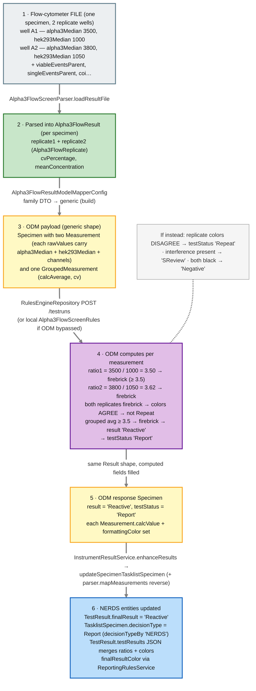

# Step 0 — Worked example: one Alpha3 Flow specimen, end to end

`odm-payload-mapping.md` explains the *layers* in the abstract. This file traces **one real specimen** through all of them — instrument file → parser → measurements → ODM payload → ODM decision → back onto NERDS entities — with concrete field names and sample numbers, so the layers have something to hang on. It also defines the two terms you'll hit constantly here: **"translate"** and **"enhance results."**

> **Cross-checked against the backend.** `controllers/ResultsController.java` (`/translate`), `services/InstrumentResultService.java` (`enhanceResults`, `updateSpecimenTasklistSpecimen`), `constraints/instrument_results/Alpha3FlowScreenParser.java` + `Alpha3FlowBaseParser.java`, `dtos/results/Flow/Alpha3/Alpha3FlowResult.java` + `Alpha3FlowReplicate.java`, `config/instrument_results/Alpha3FlowResultModelMapperConfig.java`, `config/interceptors/rules_engine/Alpha3FlowScreenRules.java`. The **sample numbers below are illustrative**; the field names, the mapping, and the decision logic are from the code.

---

## First: what are "translate" and "enhance results"?

They're two names for the **same operation at two layers** — the thing the **"Send to ODM"** button triggers:

- **Translate** — the HTTP action. `POST /api/results/translate?tasklistStepId=…&updateBkgd=…` (and `/translate/ifa` for IFA). It "translates" the parsed instrument measurements into *interpreted* results by round-tripping through ODM. It's gated by `canEditTestingOrConsultant()`.
- **Enhance results** — the service method the endpoint calls: `InstrumentResultService.enhanceResults(...)`. It "enhances" the plain measurements by attaching ODM's computed values (final result, decision, colors, background), then `saveResultsAndTasklist(...)` persists them.

So: **button "Send to ODM" → `POST /translate` → `enhanceResults()` → ODM round trip → save.** When someone says "translate the plate" or "the enhanced results," they mean this.

---

## The specimen we'll follow

**Assay:** *Alpha3 Flow* — a **flow-cytometry, cell-based assay**. Cells expressing a target antigen (here the "alpha3" line) and a control cell line (HEK293) are exposed to patient serum; the cytometer measures how brightly antibodies bound to each, as a **median fluorescence** per cell population. The result is essentially a **ratio**: how much brighter the alpha3 cells are than the HEK293 control.

**Our specimen** was run in **two replicate wells** (A1, A2). Illustrative raw values the cytometer wrote to the file:

| well | `alpha3Median` | `hek293Median` | (also: viableEventsParent, singleEventsParent, alpha3NumEvents, nonAggregateParent, coi) |
|---|---|---|---|
| A1 | 3500 | 1000 | … |
| A2 | 3800 | 1050 | … |

---

## The trace

## Step by step

**① The file (raw instrument output).** The flow cytometer writes a file with one row per well, each carrying the cell-population channels: `viableEventsParent`, `singleEventsParent`, `alpha3NumEvents`, `alpha3Median`, `hek293Median`, `nonAggregateParent`, and a computed `coi`. Nothing is interpreted yet — these are just brightness/count numbers.

**② The parser turns the file into a family DTO.** `Alpha3FlowScreenParser` (a subclass of `Alpha3FlowBaseParser`) is fetched via `InstrumentResultParsers.getParser("Alpha3 Flow", …)`. Its `loadResultFile` reads the rows; replicate wells A1/A2 become two `Alpha3FlowReplicate` objects, grouped into one `Alpha3FlowResult` per specimen (with `replicate1`, `replicate2`, a `cvPercentage`, and `meanConcentration`/`titer`). This is also where wells are matched to plate spots.

**③ The ModelMapper adapter converts the family DTO into ODM's generic shape.** `Alpha3FlowResultModelMapperConfig` (registered in `ModelMapperConfig`) has the `TypeMap`s:
- `Alpha3FlowReplicate → Measurement`: sets `type="current"`, `excluded`, `calcValue` ← titer-or-concentration, and — the key part — packs the cytometry channels into `Measurement.rawValues` as named entries: **`viableEventsParent, singleEventsParent, alpha3NumEvents, alpha3Median, hek293Median, nonAggregateParent`** (plus `calcValues = [averageValue = coi]`).
- `Alpha3FlowResult → GroupedMeasurement`: `calcAverage` ← titer-or-`meanConcentration`, `cv` ← `cvPercentage`.

So the specimen now looks like ODM expects: a `Specimen` with **two `Measurement`s** (each carrying `alpha3Median`/`hek293Median` in `rawValues`) and **one `GroupedMeasurement`**.

**④ ODM computes the decision** (or, when bypassed for QA, `Alpha3FlowScreenRules` does the same logic locally). Per the code:
- For each measurement: `ratio = alpha3Median / hek293Median`, rounded to 2 dp, written to `calcValue`; `formattingColor = "firebrick"` if `ratio ≥ 3.5` else `"black"`.
  - A1: `3500 / 1000 = 3.50` → firebrick. A2: `3800 / 1050 = 3.62` → firebrick.
- Grouped: average the ratios; firebrick if `avg ≥ 3.5`.
- Per specimen → `testStatus`:
  - **`SReview`** if interference is present;
  - **`Repeat`** if the replicate colors *disagree* (more than one distinct color across replicates);
  - otherwise **`Report`**, with `result = "Reactive"` if any grouped color is firebrick, else `"Negative"`.
- Our case: both replicates firebrick (agree) → **Report**; a grouped firebrick → **`result = "Reactive"`**.

**⑤ ODM responds in the same shape**, now with the computed fields filled: `Specimen.result = "Reactive"`, `Specimen.testStatus = "Report"`, and each `Measurement` has its `calcValue` (the ratio) and `formattingColor`.

**⑥ `enhanceResults` writes it back onto NERDS entities** (`updateSpecimenTasklistSpecimen`):
- `TestResult.finalResult = "Reactive"` (from `Specimen.result`).
- `TasklistSpecimen.decisionType = Report` (from `Specimen.testStatus` via `resultDecisionType()`), `decisionTypeBy = "NERDS"`.
- The measurements are **merged** into `TestResult.testResults` (JSON) via the parser's `mapMeasurements` + the reverse `TypeMap` (`Measurement → Alpha3FlowReplicate`, repopulating `alpha3Median`, `hek293Median`, `coi ← averageValue`, `well ← name`) — so the ratios and colors are stored for display.
- `finalResultColor` is computed by `ReportingRulesService.runReportingRules(testCode, "Reactive")`, possibly overridden by the grouped `formattingColor`.

Then `saveResultsAndTasklist` persists everything. Because the decision was **Report**, this specimen is now reportable — it heads toward Sign Out → Soft (see `review-stage.md`). Had ODM returned `SReview`, it would instead land on the Specialist's queue (the decision ladder in `review-stage.md`, Diagram 2).

---

## What this example anchors

- **"Calculated data" is layer ③–④'s input/output:** the ratios (`3.50`, `3.62`) are calculated values, not raw and not the final "Reactive" — exactly the middle layer defined in `review-stage.md`.
- **The per-family layers each did one job:** the *parser* read the file into `Alpha3FlowReplicate`; the *ModelMapper config* packed those into generic `Measurement.rawValues`; ODM (or its local twin) applied the `≥ 3.5` rule; `enhanceResults` wrote the answer back. Swap in RT-QuIC and only the field names and the rule change — the *shape* of the trace is identical.
- **"Reactive/Negative" vs "Report/Repeat/SReview" are two different outputs:** `result` (the clinical value) and `testStatus` (where it goes next). ODM sets both; NERDS maps them to `TestResult.finalResult` and `TasklistSpecimen.decisionType` respectively.

> **Honest notes:** (1) the numbers are illustrative — only the field names, mappings, and the `≥ 3.5`/firebrick/Reactive logic come from the code (from the *local* `Alpha3FlowScreenRules`, which mirrors what ODM does; the real ODM ruleset lives outside this repo). (2) This is the *screen* variant; `Alpha3FlowTitrationParser`/`Alpha3FlowTitrationRules` handle the titration variant with a different calc (`titer = (sum of rawValues / 6) / 100`, `< 2` → firebrick, `Positive`/`Negative`). (3) IFA-family specimens take the `/translate/ifa` + `mapRulesEngineResults` path instead of this measurement path.

> See also: [`odm-payload-mapping.md`](odm-payload-mapping.md) (the general layers this traces), [`review-stage.md`](review-stage.md) (what happens to a `Report` vs `SReview` next), and [`../materials-qc/materials-qc.md`](../materials-qc/materials-qc.md) (the controls/lots that also ride in the payload).
