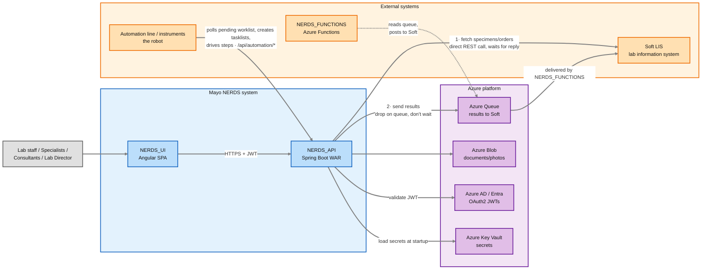
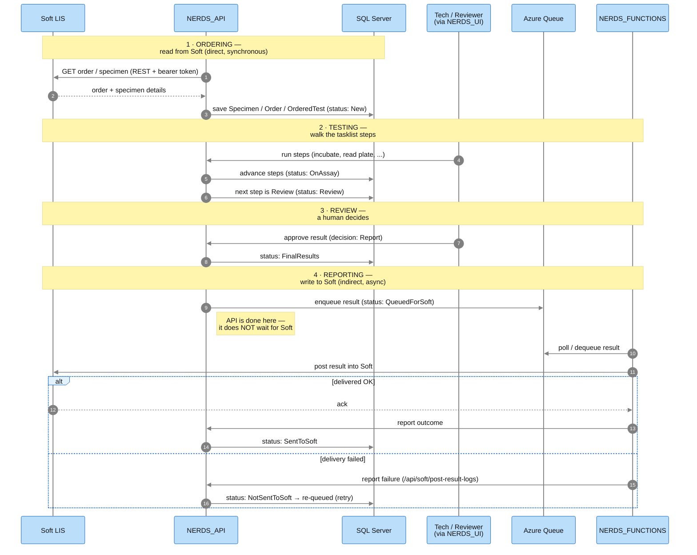
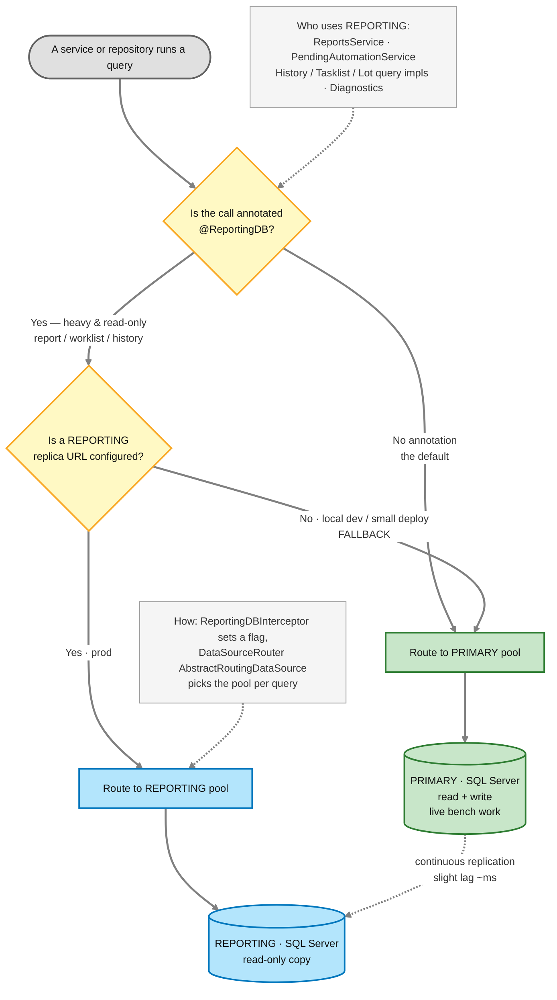

# Step 0 — NERDS_API System Architecture (Graphical View)

Where the workflow diagram ([`clinical-workflow.md`](../clinical-workflow/clinical-workflow.md)) shows *what happens to a sample*, this shows *how the software is put together* — the components, layers, and external systems, and how a request flows through them.

> **Cross-checked against both repos.** Where to look to verify this yourself — Backend `NERDS_API`: layering packages `controllers/`, `services/`, `repositories/`, `model/`; dual datasource `config/RoutingDBConfig.java` + `annotations/ReportingDB/`; auth & secrets `config/ResourceServerConfig.java`, `config/AadOAuth2LoginSecurityConfig.java`, `config/AzureKeyVaultPropertiesListener.java`; Soft + queue `SoftServiceImpl` / `SoftController`, `services/NerdsQueueService.java`, `services/AzureQueueService.java`; cross-cutting `config/ModelMapperConfig.java`, `config/SchedulerConfig.java`, `config/FrontEndAppVersionFilter.java`, `config/TimezoneFilter.java`; entry point `NerdsApiApplication.java`, `pom.xml`. Frontend `NERDS_UI`: `src/app/app-routing.module.ts`, `shared/services/` (HttpClient callers), `shared/constants/constants.ts` (the ~56 `/api/...` endpoint constants), runtime base URL via `ConfigSettings.nerdsApiBaseUrl`. (See §4 "Frontend cross-check" for more.)

---

## How to read the diagrams on this page

This page has **four diagrams**, moving from the outside in. Two are the main structural views (§1 and §2); each has a companion close-up:
- **§1 System context** (flowchart) — a *zoomed-out* view: NERDS_API as one box, and everything it talks to. "Map of the neighborhood."
  - *companion:* **Specimen round-trip** (sequence diagram) — one specimen flowing through the whole system in time order, a concrete example of §1.
- **§2 Layered architecture** (flowchart) — a *zoomed-in* view: what happens *inside* NERDS_API when a single HTTP request arrives. "Floor plan of one building."
  - *companion:* **Datasource routing** (flowchart) — a close-up of one decision inside §2: which database a query uses.

(§3 and §4 are text: how the diagrams fit together, and a frontend cross-check.)

**Shared visual grammar for the flowcharts** (standard [Mermaid](https://mermaid.js.org) flowchart notation):
- **A box** = a component, system, or processing step. **Rounded boxes** `( )` = a start/end point (an actor or an HTTP request/response). **Cylinders** = databases. **Diamonds** `{ }` = a decision/branch point.
- **A solid arrow `→`** = the main flow / a direct call. **A dashed arrow `-.->`** = a *secondary or supporting* relationship (a cross-cutting concern, a config read, an occasional call) — not the primary request path.
- **Arrow labels** (the words on a line) describe *what* travels along it or *why* the call happens (e.g. `HTTPS + JWT`, `validate JWT`, `DTO in`).
- **Colors group related things** — each color = one zone (see the legend under each diagram). The color is a grouping aid only; the arrows carry the actual meaning.
- **Read direction:** the §1 context flows **left → right** (`flowchart LR`); the §2 layered view and the routing close-up flow **top → bottom** (`flowchart TD`).

> The **sequence diagram** (specimen round-trip) uses a *different* notation — vertical lifelines and time flowing downward — explained in its own "How to read this sequence diagram" note where it appears.

---

## 1 · System context — NERDS and the systems around it

Who talks to the API, and what the API talks to.



### How to read this diagram

**Start at the far left (`Lab staff …`) and follow the arrows right.** A person uses the browser UI; the UI calls the API; the API calls out to everything else. The three colored boxes group the "everything else" into three zones.

Walk it in this order:
1. **The human → the UI → the API** (left edge). `Lab staff / Specialists / Consultants / Lab Director` use **`NERDS_UI`** (the Angular app). The UI talks to **`NERDS_API`** over **`HTTPS + JWT`** — meaning every call carries a signed login token. The two NERDS boxes (blue) are "our system"; everything else is external.
2. **NERDS ↔ Soft happens over TWO separate channels, in opposite directions** — this is the part that's easy to misread, so look at the two numbered arrows:
   - **Arrow ①  `API → Soft` (fetch specimens/orders):** a **direct, synchronous REST call**. NERDS asks Soft "give me this specimen/order/patient" and waits for the reply, like a normal web request. *(Code: `RestTemplateBearerTokenInterceptor` calling `lpea.soft.api.urls.base-url` / `CadSoftUrl` with a bearer token.)*
   - **Arrow ②  `API → Queue → Soft` (send results):** **indirect and asynchronous**. NERDS does **not** write results into Soft directly. It **drops the results on the Azure Queue and moves on** (`NerdsQueueService.postResultsToQueue` → status `QueuedForSoft`). A *different* component, **`NERDS_FUNCTIONS`**, reads that queue and posts the results into Soft. This is exactly the `QueuedForSoft → SentToSoft` (with `NotSentToSoft` retry) sequence in [`clinical-workflow.md`](../clinical-workflow/clinical-workflow.md) — the queue is *why* delivery is async and retryable.
   - **So, to answer the two most common questions directly:** *Yes*, the API fetches specimens from Soft **directly** (arrow ①). *Yes*, results go to Soft **through the queue**, never straight there (arrow ②). They are two different mechanisms — that's why they're two arrows, not one double-headed one.
3. **The Azure platform zone (purple)** — four supporting services the API leans on:
   - **Azure AD / Entra** — the API sends each incoming token here to `validate JWT` (this is the "am I allowed in?" check).
   - **Azure Key Vault** — read **once at startup** to `load secrets` (DB passwords, Soft credentials). Note this arrow is about boot-time, not per-request.
   - **Azure Blob** — where documents/photos (e.g. IFA slide images) are stored.
   - **Azure Queue** — the results-to-Soft pipeline from arrow ②.
4. **The dashed arrow (`NERDS_FUNCTIONS -.-> Queue`)** is dashed because `NERDS_FUNCTIONS` is a *separate* deployable (its own Azure Functions app, its own repo), not part of the API's request path. It's the **consumer** that empties the queue into Soft — the other half of arrow ②.

**The one-sentence takeaway:** NERDS_API is the **hub** — its inbound callers are the **UI** (people) and the **automation line** (robots, via `/api/automation/*`); it **reads** from Soft directly and **writes** to Soft through a queue; and Azure provides identity, secrets, file storage, and that async result pipeline.

### The external systems in plain English
"External" just means *not this codebase* — a system NERDS_API depends on but doesn't contain. There are two kinds here:

| Box | Colour | What it actually is | NERDS's relationship to it |
|---|---|---|---|
| **Soft LIS** | 🟠 orange | The hospital's Lab Information System — the official system of record for orders & results. (Reached via a `CAD Soft API` / `SOFT_API` service that fronts it.) | **Reads** orders/specimens from it (direct call); **writes** results back to it (via the queue). |
| **NERDS_FUNCTIONS** | 🟠 orange | A separate serverless app (Azure Functions), its own repo. | The **queue consumer** — takes results off the queue and delivers them into Soft. |
| **Automation line / instruments** | 🟠 orange | The physical lab automation ("the robot"), a separate system. | An **inbound caller** of `/api/automation/*`: polls the pending worklist, claims tests (`OnAutomation`), creates tasklists, and drives their steps. *It does the **physical** bench work and asks NERDS to **record** it as a tasklist — the tasklist is the electronic record, not a re-run. See "Automation line vs. NERDS" in [`testing-stage.md`](../testing-stage/testing-stage.md).* |
| **Azure AD / Entra** | 🟣 purple | Microsoft's identity service. | Validates the login token on every request. |
| **Azure Key Vault** | 🟣 purple | Microsoft's secret store. | Supplies passwords/credentials at startup. |
| **Azure Blob** | 🟣 purple | Microsoft's file storage. | Stores documents & photos. |
| **Azure Queue** | 🟣 purple | Microsoft's message queue. | The hand-off buffer for results going to Soft. |

The 🟠 orange boxes are *other applications* (Soft, Functions, the automation line). The 🟣 purple boxes are *cloud infrastructure* NERDS rents from Microsoft. That's the only real difference between the two external zones.

> **Two different things are called a "queue" — don't conflate them:**
> - The **Azure Queue** above (🟣 purple) is a real Azure Storage message queue, used **outbound** to push *results* to Soft (`NerdsQueueService`).
> - **"Queued for automation"** (the `OnAutomation` status) is a **logical worklist** — "ordered tests whose status = `OnAutomation`," found by a database query (`PendingAutomationService`). It's **inbound**: the automation line pulls work from it. It is *not* an Azure Queue and involves no Azure Storage at all.

> **Color legend:** 🔵 blue = the NERDS system (UI + API) · 🟠 orange = external systems / other apps (Soft, Functions, automation line) · 🟣 purple = Azure platform services · ⚪ grey = the human actor.

### Concrete example — one specimen's round trip

The context diagram shows the *wiring*; this sequence shows one specimen actually flowing through it, top to bottom, in time order. Watch the **read-is-direct / write-is-via-the-queue** split: the first stage is a synchronous there-and-back with Soft, while the last stage hands off to a queue and walks away. (A detailed, message-by-message walkthrough follows the diagram.)



### How to read this sequence diagram

A **sequence diagram** is different from the flowcharts above. A flowchart shows *possible paths*; a sequence diagram shows *one actual run, in time order*, and — crucially — **who talks to whom**.

**The grammar:**
- **Each vertical line is one participant** (a system or person). The boxes across the top name them; the line dropping from each is its "lifeline."
- **Time flows straight down.** The topmost arrow happens first; the bottom happens last.
- **Each horizontal arrow is one message** (a call from one participant to another). The words on the arrow are what's being sent/asked.
- **Solid arrow `→`** = a call/action going *out*. **Dashed arrow `-->>` (⇠)** = a *reply* coming back.
- **Yellow `Note` bands** group the messages into the four workflow stages (same stages as [`clinical-workflow.md`](../clinical-workflow/clinical-workflow.md)).
- **The `alt` box** near the bottom = "alternative branches": either the *delivered OK* path **or** the *delivery failed* path happens, not both.

**The six participants (left to right):**

| Participant | Who/what it is |
|---|---|
| **Soft LIS** | The hospital's system of record (reached via the CAD Soft API). |
| **NERDS_API** | This app — the star of the show; almost every arrow starts or ends here. |
| **SQL Server** | NERDS's own database (where the specimen's status is stored). |
| **Tech / Reviewer** | A human working through the **NERDS_UI**. |
| **Azure Queue** | The buffer that holds results waiting to go to Soft. |
| **NERDS_FUNCTIONS** | A *separate* app that empties the queue into Soft. |

**Walking it stage by stage** (follow the arrows top to bottom):

1. **① Ordering (synchronous read).** `NERDS_API` calls out to `Soft` asking for the order/specimen, and Soft **replies** (the dashed arrow) with the details. Notice this is a *there-and-back on the same two lines* — the API asked and waited. NERDS then writes the specimen to its own DB with status **`New`**. → *This is the "read directly from Soft" channel.*
2. **② Testing.** The `Tech/Reviewer` (through the UI) — or the automation system — tells the API to run the tasklist steps; the running tasklist is **`OnAssay`**, and when the next step is a review step the API flips the status to **`Review`**. *(All the step-engine detail is in [`testing-stage.md`](../testing-stage/testing-stage.md). `OnAutomation` is the earlier "queued for automation" status, not the running one.)*
3. **③ Review.** The human approves the result (decision **`Report`**); the API marks it **`FinalResults`**.
4. **④ Reporting (asynchronous write).** This is the important contrast with step ①. The API drops the result on the `Azure Queue` (status **`QueuedForSoft`**) and **stops** — see the note *"API is done here — it does NOT wait for Soft."* Then a *different* participant, `NERDS_FUNCTIONS`, picks the result off the queue and posts it into Soft. The `alt` box shows the two outcomes: on success the result becomes **`SentToSoft`**; on failure it becomes **`NotSentToSoft`** and goes back on the queue to be retried.

**The single most important thing this diagram shows:** compare the shape of stage ① with stage ④.
- In **①** the API's arrow to Soft is immediately followed by a reply on the same lines — a **synchronous** conversation (ask → wait → get answer).
- In **④** the API's arrow stops at the *queue*, and a whole separate participant continues the work later — an **asynchronous** hand-off (drop it and walk away). That gap is exactly why results can be retried without the API being involved, and why [`clinical-workflow.md`](../clinical-workflow/clinical-workflow.md) needs the `QueuedForSoft`/`SentToSoft`/`NotSentToSoft` states.

If you remember one picture for "how does a result get to Soft," it's this one: **the API never talks to Soft to deliver a result — it talks to a queue, and Functions does the delivery.**

> **Accuracy note:** the ordering/testing/review/queue steps and their status transitions are exact (from the code). The final delivery-outcome bookkeeping (who flips `SentToSoft` vs `NotSentToSoft`) is shown at a slightly simplified level — the API exposes `/api/soft/post-result-logs` for tracking failed posts, and `NERDS_FUNCTIONS` lives in its own repo, so treat that last hand-off as "approximately this" rather than line-for-line.

---

## 2 · Internal layered architecture — a request through the API

The layers every feature slices through, plus the cross-cutting concerns that wrap them.

```mermaid
%%{init: {"theme":"base", "themeVariables":{"background":"#ffffff","lineColor":"#808080","edgeLabelBackground":"#ffffff","fontSize":"14px"}, "flowchart":{"curve":"basis"}}}%%
flowchart TD
    REQ([HTTP request<br/>/api/...]) --> FILTERS

    subgraph FILTERS["Cross-cutting filters / security"]
        SEC[OAuth2 Resource Server<br/>ResourceServerConfig — validate JWT]
        VER[FrontEndAppVersionFilter<br/>UI version gate]
        TZ[TimezoneFilter]
    end
    FILTERS --> CTRL

    subgraph APP["Application layers"]
        direction TB
        CTRL[controllers/<br/>@RestController · request mapping · permission checks]
        SVC[services/<br/>business logic · clinical rules engine]
        REPO[repositories/<br/>Spring Data JPA + QueryDSL]
        MODEL[model/<br/>JPA entities]
        CTRL -->|DTO in| SVC
        SVC --> REPO
        REPO --> MODEL
    end

    CTRL -.->|entity ↔ DTO| MM[ModelMapper<br/>ModelMapperConfig]
    SVC -.->|reads clinical config| YAML[application.yaml<br/>test families, scanlists,<br/>tasklist, plate layouts]
    SVC -.->|scheduled jobs| SCHED[SchedulerConfig<br/>ShedLock distributed lock]

    MODEL --> ROUTER

    subgraph DATA["Persistence"]
        ROUTER{DataSourceRouter<br/>@ReportingDB?}
        PRIMARY[(SQL Server<br/>PRIMARY pool)]
        REPORTING[(SQL Server<br/>REPORTING replica<br/>falls back to PRIMARY)]
        FLYWAY[Flyway migrations<br/>db/migration]
        ROUTER -->|default| PRIMARY
        ROUTER -->|read-only reporting| REPORTING
        FLYWAY -.->|manages schema| PRIMARY
    end

    SVC -->|final result| RESP([HTTP response<br/>DTO as JSON])

    %% ---- node fills with near-black text (renders reliably everywhere) ----
    classDef filters fill:#ffcdd2,stroke:#c62828,stroke-width:2px,color:#111111;
    classDef app     fill:#c8e6c9,stroke:#2e7d32,stroke-width:2px,color:#111111;
    classDef data    fill:#b3e5fc,stroke:#0277bd,stroke-width:2px,color:#111111;
    classDef aux     fill:#fff9c4,stroke:#f9a825,stroke-width:2px,color:#111111;
    classDef edge    fill:#e0e0e0,stroke:#616161,stroke-width:2px,color:#111111;

    class SEC,VER,TZ filters;
    class CTRL,SVC,REPO,MODEL app;
    class ROUTER,PRIMARY,REPORTING,FLYWAY data;
    class MM,YAML,SCHED aux;
    class REQ,RESP edge;

    %% subgraph backgrounds + dark title color (so titles show in dark themes)
    style FILTERS fill:#ffebee,stroke:#c62828,stroke-width:2px,color:#111111
    style APP     fill:#e8f5e9,stroke:#2e7d32,stroke-width:2px,color:#111111
    style DATA    fill:#e1f5fe,stroke:#0277bd,stroke-width:2px,color:#111111

    linkStyle default stroke:#808080,stroke-width:2.5px
```

### How to read this diagram

**Start at the top (`HTTP request /api/...`) and read straight down** — this traces one request from the moment it hits the server to the JSON that goes back. This is the inside of the single `NERDS_API` box from §1.

Walk it top-to-bottom:
1. **Filters / security (red band) — the gate.** Before *any* business logic runs, the request passes through servlet filters. `OAuth2 Resource Server` validates the JWT (rejects it here if the token is bad — this is the client side of the "validate JWT → Azure AD" arrow in §1). `FrontEndAppVersionFilter` checks the UI is a compatible version; `TimezoneFilter` sets up time handling. **Takeaway: unauthorized requests never reach your code.**
2. **Application layers (green band) — the strict pipeline.** This is the heart. Read the four boxes top-down; each only talks to the one below it:
   - `controllers/` — receives the HTTP request, does permission checks, converts the incoming **DTO**.
   - `services/` — the business logic and clinical rules engine (where the real work happens).
   - `repositories/` — data access (Spring Data JPA + QueryDSL).
   - `model/` — the JPA entities (the objects that map to DB tables).
   - **The rule to remember:** the arrows only go `controller → service → repository → model`. A controller never reaches straight into a repository, and an entity never calls back "up." If you're reading code and see a layer skipped, that's unusual.
3. **The dashed side-arrows = cross-cutting helpers.** These aren't a separate step in the pipeline; they're things a layer *reaches for*:
   - `ModelMapper` — converts entity ↔ DTO at the controller edge.
   - `application.yaml` — services **read clinical config** from it (test families, plate layouts). This is the "clinical behavior is data" idea made visible.
   - `SchedulerConfig / ShedLock` — background scheduled jobs (not part of a normal request, hence dashed).
4. **The persistence decision (blue band) — the diamond.** `DataSourceRouter {@ReportingDB?}` is a **branch**: if a query is annotated `@ReportingDB` it goes to the **REPORTING** read replica; otherwise the **PRIMARY** database. (If no replica is configured, REPORTING falls back to PRIMARY.) `Flyway` is off to the side because it **manages the schema** (migrations), it isn't part of serving a request.
5. **The response (bottom).** `services` produces the result, which is serialized back out as `HTTP response · DTO as JSON`.

**The one-sentence takeaway:** every request is *gated* (filters), then flows through *strict layers* (controller → service → repo → model), with config and mapping pulled in on the side, and a *routing decision* picking which database to hit.

> **Color legend:** 🔴 red = security/filters (the gate) · 🟢 green = the core app layers · 🔵 blue = persistence / databases · 🟡 yellow = cross-cutting helpers (mapper, config, scheduler) · ⚪ grey = request in / response out.

### What does "cross-cutting" mean?

A **cross-cutting concern** is a piece of behavior that **many parts of the app need, but which isn't the "main job" of any single layer** — so instead of copy-pasting it into every controller/service, it's factored out into one place and applied across the board. The name comes from the idea that it *cuts across* the normal top-to-bottom layers rather than living inside one of them.

Think of the green pipeline (`controller → service → repository → model`) as the **assembly line** for one request — each station does its specific job. A cross-cutting concern is like **the lighting, security cameras, and the PA system in the factory**: every station depends on them, but none of them *is* any station's job, and you install them once for the whole building, not per workstation.

In this diagram, cross-cutting concerns show up in **two visual forms**:

1. **The red "filters / security" band — cross-cutting things that run *before* the pipeline, on *every* request.** Authentication (validate the JWT), the UI-version check, and timezone setup apply to essentially all endpoints. Rather than each controller re-checking the token, a **servlet filter** does it once, up front, for everyone. That's why they're drawn wrapping the top, not inside a layer.

2. **The yellow dashed helpers — shared services any layer can *reach for*.** These aren't a step in the request's path (that's why the arrows are **dashed**, not solid); they're utilities used from many places:
   - **`ModelMapper`** — entity↔DTO conversion. Needed at every controller boundary, so it's one configured helper instead of hand-written mapping in each controller.
   - **`application.yaml` config** — clinical configuration read by many services. Centralized, not duplicated.
   - **`SchedulerConfig` / ShedLock** — background scheduled jobs. Orthogonal to any single request entirely.

**Why it matters when you read the code:** if you're chasing "where does authentication happen?" or "where do entities become DTOs?", the answer usually **isn't** in the controller/service you're looking at — it's in one of these cross-cutting places (a filter, a config class, the mapper). Spring implements these with mechanisms like **servlet `Filter`s, `@Aspect`/AOP, interceptors, and `@ConfigurationProperties`** — all ways of saying "apply this everywhere without writing it everywhere." Other cross-cutting concerns in NERDS you'll meet later: logging, auditing (`AuditorAwareImpl`), exception handling (`ControllerExceptionHandler`), and the `@ReportingDB` datasource routing.

### Why is there a REPORTING replica database?

The blue band shows **two** SQL Server databases — a **PRIMARY** and a **REPORTING** replica — with the `DataSourceRouter` diamond choosing between them. Why not just one?

**The problem it solves:** the PRIMARY database is busy doing the lab's real-time work — every specimen registration, every tasklist step, every review decision is a small, fast read/write against it. Now imagine someone runs a **big report** ("all results for the last quarter") or the system builds a **large worklist** ("every specimen pending automation"). Those queries scan huge amounts of data and can run for many seconds. If they hit the **same** database, they compete for the same CPU, memory, and locks as the live bench work — so a tech clicking "complete step" suddenly waits, because a report is hogging the database. Heavy reads and time-sensitive writes don't share a database gracefully.

**The fix:** keep a second, **read-only copy** of the database (a *replica*) that PRIMARY continuously syncs to. Point the heavy, read-only queries at the replica instead of PRIMARY. Now:
- **The bench stays fast** — big reports/worklists run on REPORTING and never slow down the live transactional work on PRIMARY.
- **Read load is spread across two servers** instead of piling onto one.
- Because the replica is read-only, there's no risk a report accidentally changes live data.

**How NERDS picks which DB:** a query is opted-in to the replica with the **`@ReportingDB`** annotation; the `DataSourceRouter` (an interceptor) sees it and routes that query to REPORTING. Everything **without** the annotation goes to PRIMARY (the safe default — you never accidentally read *stale* replica data for a transaction). In the code, `@ReportingDB` is applied to exactly the read-heavy, non-transactional things: **`ReportsController` / `ReportsService`** (reports), **`PendingAutomationService`** (building automation worklists), and the large query implementations in **`HistoryRepositoryImpl` / `TasklistRepositoryImpl` / `LotRepositoryImpl`**, plus `DiagnosticsController`.

**The important safety net:** if **no** reporting URL is configured (e.g. a local dev machine, or a smaller deployment), `RoutingDBConfig` makes REPORTING **fall back to PRIMARY**. So the annotation is always safe to use — with a replica it offloads work; without one, it just runs on the primary as normal. Nothing breaks either way.

> **The trade-off to be aware of:** a replica is usually a *tiny* bit behind PRIMARY (replication lag — often milliseconds). That's fine for reports and worklists, which don't need to-the-instant data. It's why only *reads that can tolerate slight staleness* get `@ReportingDB`, and anything transactional stays on PRIMARY.

#### How the app chooses which database

The single `DataSourceRouter` diamond in the §2 diagram unpacks into this decision:



**How to read it:** start at the top and follow the two diamond decisions.
1. **`@ReportingDB?`** — the *default is PRIMARY*. A query only takes the replica branch if it's explicitly opted in with the annotation. (Safe by design: you can't *accidentally* read from the possibly-stale replica.)
2. **Reporting URL configured?** — even an annotated query checks whether a replica actually exists. In production it does → REPORTING. On a laptop/local dev or a smaller deployment it doesn't → it **falls back to PRIMARY**, so nothing breaks.
3. The **dashed `PRIMARY -.-> REPLICA`** arrow is the *replication* — PRIMARY continuously copies its data to the read-only replica (with the small lag noted above). This is done by SQL Server/infra, not by the app.
4. The two grey **note boxes** name the real code: *who* opts in (`ReportsService`, `PendingAutomationService`, the big query impls) and *how* the routing is wired (`ReportingDBInterceptor` flips a flag; `DataSourceRouter`, a Spring `AbstractRoutingDataSource`, picks the HikariCP pool per query — see `config/RoutingDBConfig`).

**One-line summary:** *no annotation → PRIMARY; `@ReportingDB` → REPORTING if it exists, otherwise PRIMARY.*

---

## 3 · How the diagrams fit together

| Diagram | Answers the question | Key takeaway |
|---|---|---|
| **§1 System context** | "What does NERDS_API connect to?" | The API is the hub between the Angular UI, the Soft LIS, and four Azure services (AD, Key Vault, Blob, Queue). |
| **↳ Specimen round-trip** (sequence) | "What does one specimen's journey look like over time?" | Read from Soft is synchronous; write to Soft is async via the queue + NERDS_FUNCTIONS. |
| **§2 Layered architecture** | "What happens inside the API on one request?" | JWT → filters → `controller → service → repository → entity`, with ModelMapper at the edge, YAML config feeding the services, and a **routing datasource** choosing PRIMARY vs. REPORTING. |
| **↳ Datasource routing** (flowchart) | "Which database does a given query use?" | Default → PRIMARY; `@ReportingDB` → REPORTING replica (falls back to PRIMARY if none configured). |

### The five things worth memorizing from the graphical view
1. **Security is a filter, before controllers** — every `/api/...` call needs a valid Azure AD JWT (`ResourceServerConfig`).
2. **Layers are strict** — controllers never touch repositories directly; logic lives in services.
3. **DTOs at the edge, entities inside** — `ModelMapper` bridges them; DTO changes usually need a matching UI change.
4. **Two databases** — the `@ReportingDB` annotation routes a query to the read replica; otherwise PRIMARY. Flyway owns the schema.
5. **Clinical behavior is data** — services read `application.yaml` (test families, tasklists, plate layouts) at least as much as they read the DB.

---

## 4 · Frontend cross-check (`NERDS_UI`)

Verified against the Angular repo at `/Users/lin.pengpeng/IdeaProjects/NERDS_UI` — the "NERDS_UI" node in §1 is:
- **Angular 20** SPA (`nerds-ui`, `package.json` **1.20.0**), **NgRx** for state (`@ngrx/store` + `effects` + `component-store`), PrimeNG + Mayo Clinic component libs. Routing is a **single non-lazy tree** (`src/app/app-routing.module.ts`) because NgRx state/effects are shared across features.
- **The API base URL is loaded at runtime, not compiled in.** `environment.ts` only holds a `production` flag; the real base URL comes from server config into `ConfigSettings.nerdsApiBaseUrl`, and the ~56 `/api/...` paths are constants in `shared/constants/constants.ts`. So "which API am I hitting" is a deploy-time/runtime config, not a build.
- **Auth mirrors the backend:** every feature route is `AuthGuard`-protected and tagged with `oauthConfigName: nerdsApiConfName` + an `AppSection` — the UI's roles/sections pair with the API's Azure AD group model.
- **Contract coupling is real but unenforced:** the UI calls DTO-shaped endpoints but types workflow `status` as plain `string` (no shared enum). A backend contract/status change won't break the UI build — you must update the UI by hand. (See the "Gotcha" note in [`clinical-workflow.md`](../clinical-workflow/clinical-workflow.md).)

> Render with the IntelliJ/VS Code Mermaid plugin, GitHub/Azure DevOps preview, or paste into <https://mermaid.live>.
