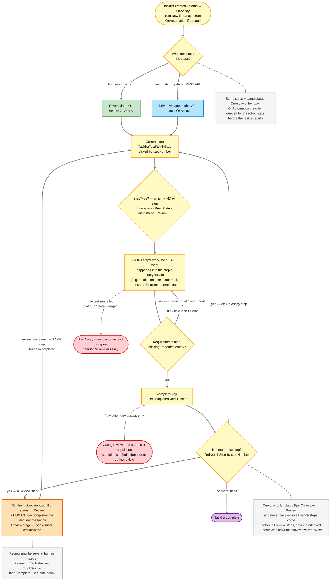
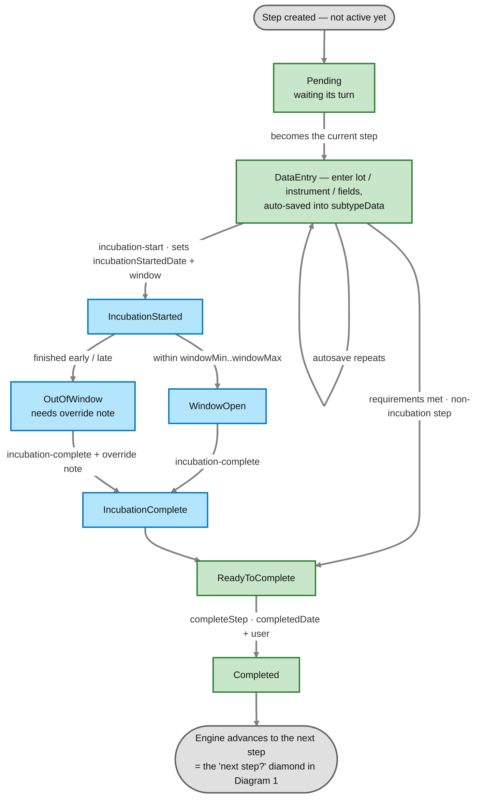
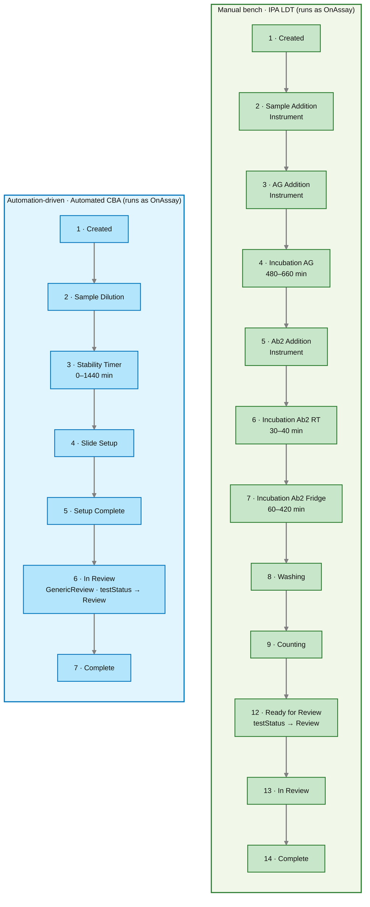
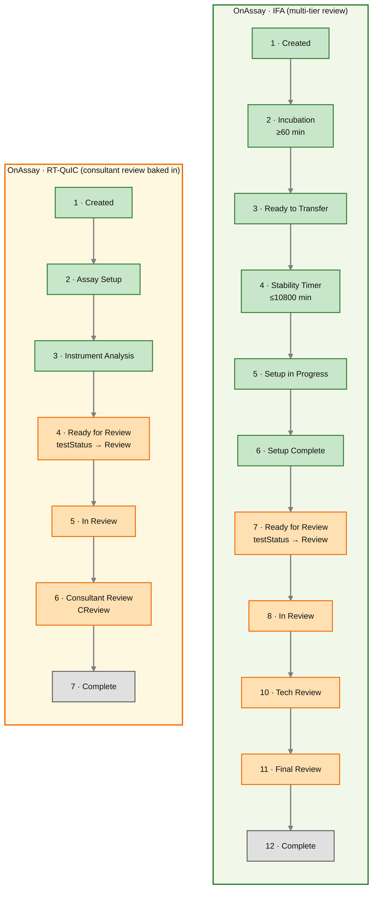

# Step 0 — The Testing Stage in Detail (OnAssay & OnAutomation)

In the top-level [`clinical-workflow.md`](../clinical-workflow/clinical-workflow.md) diagram, all of "Testing" is one green band that splits into an automation-driven and a manual path (both running as `OnAssay`). That was a deliberate compression — the Testing stage is actually the **most structured, data-driven part of NERDS**. This file zooms in.

> **Cross-checked against both repos.** Where to look to verify this yourself — Backend `NERDS_API`: step model `model/TasklistTestFamilyStepType.java`, `model/TasklistTestFamilyStep.java`, `model/TasklistStep.java`, `model/Tasklist.java`; engine `services/tasklist_steps/` (esp. `BaseTasklistStepService.java`, `TasklistStepService.java`, `dynamic/`, `IncubationService`, `ReadPlateService`), `services/TasklistService.java` (`createTasklist`), `services/TestingService.java`; drivers `controllers/TasklistController.java`, `controllers/TestingController.java`, `controllers/automation/TasklistStepAutomationController.java`; the actual step lists live in Flyway seed migrations `db/migration/V1_*__*TestFamily*.sql`. Frontend `NERDS_UI`: `features/testing/` (esp. `tasklist/schedule/schedule.component.ts` + shared `shared/components/wizard/`), `features/testing/store/` (`tasklist/`, `tasklist-step/`, `tasklist-plate/`), and automation support screens (`create-tasklist`, `batch-tasklist`, `gating-review`, `take-photo`).

> **Term used throughout: "test family."** A **test family** (`TestFamily` in code, e.g. `IFA`, `RT-QuIC`, `IPA LDT`, `MAP1B`, `Automated CBA`) is NERDS's grouping of related assays. It's the unit that **owns one ordered step list** (`TasklistTestFamilySteps` rows keyed by `TestFamily`) and contains one or more orderable NERDS tests. This file often shortens "test family" to just **"family."** Hierarchy: *test family → its one step list → the NERDS tests that belong to it.*

> **Term used throughout: "lot."** A **lot** is a specific **batch** of a lab material (a reagent, control, or other consumable) from one manufacturing run — with a unique **lot number**, its own **expiration date**, and its own QC/approval status (think of the batch code on a milk carton). When a step needs the tech to record which reagent batch was used, that's the **lot** — captured as a step *requirement* and saved into `subtypeData`. Using an expired/unapproved lot is what triggers the "lot override" you'll see later (`model/Lot.java`, `model/Inventory.java`).

---

## The one big idea

**A tasklist is an ordered list of steps, and both the manual bench and the automation robot walk the *same* list.** The difference is only *who* drives it:

- **a human** completes the steps through the UI wizard (Schedule tab), **or**
- **the automation system** completes the *identical* steps through the automation REST API (`TasklistStepAutomationController`).

Both walk the **same** steps — they're defined per test family, not per driver.

**But watch out — `OnAssay` / `OnAutomation` are *not* "human driver vs machine driver."** That's the natural guess, and it's wrong. They're **different lifecycle stages**:
- **`OnAssay`** = *a tasklist has been created and its steps are being worked* — the "on the bench, in progress" status. This is the status **whether the steps are driven by a human or by the automation system.** ("Assay" = the lab test procedure; "On Assay" = "on the bench, in progress.")
- **`OnAutomation`** = an **earlier staging status**: the test has been **claimed/queued for the automation pipeline** (set from `New`, *before* any tasklist exists). When automation then creates the tasklist, the status moves **`OnAutomation → OnAssay`** and the steps run under `OnAssay` — just as a manual tasklist goes **`New → OnAssay`**.

> **Code check:** the shared `TasklistService.createTasklist` (used by *both* the manual and automation create-paths) calls `updateWorkflowStatusesToOnAssay`, which moves ordered tests from **`New` *or* `OnAutomation` → `OnAssay`**. `OnAutomation` itself is set separately by `PendingAutomationService.setOnAutomation`, only from `New`. So: `OnAutomation` = "waiting in the automation queue"; `OnAssay` = "tasklist running" (either driver).

So there aren't two testing workflows to learn — there's **one list of steps** (per family) driven by a human or the automation API, and the running tasklist is `OnAssay` either way. Everything else in this file is elaboration on that.

> **Important — "same list" means *per test family*.** For **one** family, running it manually vs by automation uses the **same** step list (same steps, different driver — human vs automation — both running as `OnAssay`). It does **not** mean the manual and automated versions have different steps. *Different families* naturally have *different* step lists — so when Diagram 3 below shows IPA LDT (12 steps) next to Automated CBA (7 steps), the difference is because they're **two different assays**, not the same test run two ways. And regardless of driver, **every family ends with a human review step** — automation does the bench work, but a person still reviews the result.

### Automation line vs. NERDS — who does what (avoiding a common confusion)

It's easy to think "if the automation robot already ran the test, why does the app still create a tasklist?" The answer is that **physical lab work** and **the electronic record** are two different things:

- **The automation line does the *physical* work** — the actual chemistry/physics: pipetting, incubating, washing, reading plates, running instruments. That's "the assay."
- **NERDS is the *system of record*** — it documents *how* the run happened, stores results, applies interpretation rules, routes to human review, and sends results to Soft.
- **A "tasklist" is the electronic *record* of one run — not the physical work.** So "create a tasklist" does **not** mean "run the test again"; it means "create the record of this run in NERDS."

The automation line doesn't create that record on its own — it **calls NERDS's `/api/automation/*` endpoints and asks NERDS to create the tasklist** and mark its steps done, reporting what it physically did (lots, instruments, incubation times, readings).

**Why the record is still needed even though the robot ran the test:** the robot does *only* the bench work. Everything after the bench must happen in NERDS, and only can if a tasklist exists —
- **human review** (every family ends in a review step),
- **interpretation rules** (raw readings → a reportable result),
- **reporting to Soft** (results flow back to the LIS only from a NERDS record),
- **traceability / compliance** (an auditable record of who/what did each step, when, with which lots/instruments).

> **Analogy:** a self-checkout machine physically scans your groceries (the bench work) but still writes a **transaction record** into the store's system (the tasklist). The record isn't re-scanning the items — it's what lets the store do inventory, returns, and accounting (≈ review, interpretation, reporting). Without it, the scan is invisible to everything downstream.

**In one line:** the automation line is a *driver/data source* that performs the bench work and reports it into NERDS; NERDS records it as a tasklist so it flows through the same review → rules → reporting pipeline as a manually-run test — a robot instead of a person completing the steps.

*(Timing caveat: the step endpoints — `incubation-start`/`complete`, a `…/completed` poll — suggest the automation reports steps fairly incrementally as it runs them, but the exact timing of the physical line isn't verified here; treat it as "roughly incremental.")*

### "The step list is data, not code" — what that means

Here's the key design choice, and why it matters.

**If the steps were *code*,** each assay would have its own hardcoded sequence baked into Java — a `runIpaLdtAssay()` method, a `runIfaAssay()` method, and so on. Adding a new test or reordering a step would mean editing and redeploying the application.

**Instead, the steps are *data*** — plain rows in a database table called **`TasklistTestFamilySteps`**, one row per step, seeded per test family by Flyway migrations. The Java code is a **single generic engine** that just reads those rows in order and runs whatever it finds. To add a new assay or change an existing one, you **insert/update rows** (in a migration) — you don't write new workflow code.

Think of it like a **playlist vs. a hardcoded song order**: the music player (the engine) doesn't know or care what songs are on the playlist; it just plays row 1, then row 2, then row 3. Each test family is a different playlist; the player is the same.

Concretely, a few rows for the **IPA LDT** family look like this (real data from `V1_227__IpaVendedAndIpaLDTTestFamilyStepsSetup.sql`):

| `stepNumber` | `stepType` | `tasklistStatus` | `testStatus` |
|---|---|---|---|
| 4 | `Incubation` | Incubation AG | On Assay |
| 5 | `Instrument` | Ab2 Addition | On Assay |
| 12 | `Instrument` | Ready for Review | **Review** |
| 13 | `Review` | In Review | **Review** |
| 14 | `CompleteOnly` | Complete | Complete |

### What each of the four columns is for

- **`stepNumber`** — the **order**. The engine advances by picking the next-higher `stepNumber` (`findNextTlStep`). (Numbers can have gaps — that's fine; only the ordering matters.)
- **`stepType`** — **what kind of step** it is (`Incubation`, `ReadPlate`, `Instrument`, `Review`, `CompleteOnly`, …). This is an *enum* (`TasklistTestFamilyStepType`) — the one part that *is* code, because each type maps to a handler service that knows how to run that kind of step (e.g. `Incubation` → `IncubationService`).
- **`tasklistStatus`** — the **fine-grained human label** shown on the bench for this specific step: "Incubation AG", "Ab2 Addition", "Ready for Review". There are dozens of these across a family. They're free-text strings, not an enum.
- **`testStatus`** — the **coarse phase** this step belongs to. It collapses all those dozens of fine labels down to a handful of values: **On Assay / Review / (CReview) / Complete**.

### How the fine steps map back to the top-level status

This is the part worth slowing down on. There are really **three levels of "status"**, from most detailed to least:

| Level | Example values | Who sees it |
|---|---|---|
| `tasklistStatus` (per step) | "Incubation AG", "Ab2 Addition", "Counting" | the tech at the bench (fine detail) |
| `testStatus` (per step, coarse) | On Assay · Review · CReview · Complete | the phase grouping |
| **`WorkflowStatusType`** (per OrderedTest) | `OnAssay`/`OnAutomation`, `Review`, `CReview`, `FinalResults`… | the top-level lifecycle in [`clinical-workflow.md`](../clinical-workflow/clinical-workflow.md) |

The **`testStatus` column is the bridge** between the detailed bench view and the top-level lifecycle. As the engine advances step by step, it keeps the OrderedTest's `WorkflowStatusType` in sync with the current step's `testStatus`:
- while stepping through `testStatus = On Assay` rows, the test sits in **`OnAssay`** (regardless of whether a human or the automation system is driving the steps);
- the moment the **next** step's `testStatus` is `Review`, the engine flips the test to **`Review`** (`updateWorkflowStatusIfReviewStepIsNext()`), which is exactly where [`clinical-workflow.md`](../clinical-workflow/clinical-workflow.md) picks up;
- a `CReview` step maps to the `CReview` workflow status, and the final `Complete` step ends the tasklist.

So the dozens of fine bench steps in a family "roll up" into the four or five coloured boxes you saw in the main workflow diagram — via the `testStatus` column. That's why the Testing stage looked like a single box there but expands into all this detail here.

---

## Diagram 1 — The step engine (how any tasklist advances)

This is the generic loop that drives *every* assay, manual or automated.



### How to read this diagram

**The shape to notice first: it's a loop.** The middle of the diagram (`Current step → stepType? → Do the work → Requirements met? → completeStep → next step? → back to Current step`) is a cycle the engine runs **once per step** in the tasklist. It keeps going around — step 1, step 2, step 3… — until it hits an exit. Don't read it as a long straight line; read it as "do one step, then loop back and do the next."

**Two shapes of node to keep straight:**
- **Diamonds `{ }` are questions** the engine asks (there are three: *Who drives?*, *stepType?*, *Requirements met?*, *next step?*).
- **Rectangles are actions/states.** **Rounded** boxes (`START`, `TOREVIEW`, `DONE`, `FAIL`, `GATING`) are entry/exit points — places the flow *starts or leaves* the loop.

**Walk it once, top to bottom:**

1. **`Tasklist created` → `Who completes the steps?`** The first fork is where the **driver** is decided — a **human** via the UI (green) or the **automation system** via the REST API (blue). **Both run under the same status, `OnAssay`** (the create step set it, moving `New → OnAssay` for manual or `OnAutomation → OnAssay` for automation). *Both arrows point to the same next box* — the visual proof that the two paths share one step list. After this fork, the driver never matters again. (`OnAutomation` is the earlier "queued for the robot" state, before this diagram starts — see the grey note.)
2. **`Current step`** — the engine looks up the current row in `TasklistTestFamilySteps` (chosen by `stepNumber`). This box is the **top of the loop** — you'll return here for every step.
3. **`stepType?`** — the engine asks what *kind* of step this is (Incubation? ReadPlate? Instrument? Review?) and hands off to the matching handler. (In the diagram this is one diamond standing in for "dispatch to the right handler.")
4. **`Do the step's work`** — the actual bench/instrument action happens, and the results are written into the step's `subtypeData` (e.g. `incubationStarted`, `plateRead`, the lot used, the instrument, the readings).

   > **Don't confuse `stepType` with `subtypeData`** (they look alike but are different things):
   > - **`stepType`** = the *kind* of step, an **enum**, chosen at the `stepType?` diamond — e.g. `Incubation`, `ReadPlate`, `Instrument`, `Review`.
   > - **`subtypeData`** = the *data produced by doing* that step, saved in the `Do the step's work` box — e.g. the incubation start time, the plate-read completion, the lot/instrument used.
   >
   > The items listed inside that yellow box (`incubation time`, `plate read`, `lot`, …) are **examples of saved data, not a menu of step types to pick from.** Rough analogy: `stepType` is *which form you're filling out*; `subtypeData` is *what you write on it*.
5. **`Requirements met?`** — the **gate**. Before the step can complete, its requirements must be satisfied (a lot entered, an instrument selected, a file uploaded — whatever that step needs). If not (`missingProperties` is non-empty), the arrow loops **back to `Do the work`**: *you can't move on until it's filled in.* This is the small inner loop, and it's why the UI's "Continue" button is greyed out until the step is done.

   > **Yes — "lot / instrument / file / field" are the step's *requirements*.** A step can declare **requirements**: rules like "a **lot** number must be entered," "an **instrument** must be selected," "a **file** must be uploaded," "a **checkbox** ticked," or "a **text** value filled in." (In code these are the `Requirement` types / the `DynamicFieldType` enum: `Lot`, `Instrument`, `FileUpload`, `Text`, `Checkbox`, `BufferKit`, …)
   >
   > When you try to complete the step, the engine checks each requirement against what's actually been entered and returns **`missingProperties`** — the live list of requirements *still unmet right now*. So the two terms are related but not the same:
   > - **requirement** = the *rule* ("this step needs a lot #") — fixed for that step type.
   > - **`missingProperties`** = the *current list of unmet requirements* — shrinks as you fill things in.
   >
   > "Requirements met?" is therefore literally *"is `missingProperties` empty?"* — empty → proceed; non-empty → the **no** branch, and the missing items are exactly what the UI tells you to fill in (and why Continue stays greyed out). The `lot / instrument / file / field` in the diagram are **examples** of requirements, not a fixed set — each step type has its own.
6. **`completeStep`** — once the gate passes, the step is stamped done (`completedDate` + who did it).
7. **`Is there a next step?` (`findNextTlStep`)** — after completing a step, the engine looks for the next row by `stepNumber`. The word **"yes" (previously "exists")** just means *there is a next step*; the alternative is **"no more steps"** (the tasklist is finished). If a next step *does* exist, the engine then looks at **its `testStatus`** (the phase) to decide what happens — so this one diamond really answers two things: *is there a next step, and if so what phase is it?* Three outcomes:
   - **yes, and it's an `On Assay` step** → the current-step pointer moves to it and the **bench loop continues** (back up to `Current step`) — more testing work.
   - **yes, but it's a `Review` step** → **it *does* advance to that step** (the review step becomes the current step) — and the OrderedTest's top-level status **flips to `Review`** (only on the *first* review step). The work changes from bench to **human review**, but the step still runs through the **same loop** — it just loops back to `Current step` and is completed by a person, not the bench. This is the Review stage of [`clinical-workflow.md`](../clinical-workflow/clinical-workflow.md).
   - **no more steps** → **`Tasklist complete`**. *This is how the tasklist ends:* after the last review step is completed, `findNextTlStep` finds nothing more, so the flow reaches `Tasklist complete`. In other words, review steps keep going around the loop (human-driven) until there are no steps left.

   > **So does it go to the next step when `testStatus = Review`? Yes — it advances to it.** The review step isn't skipped; it becomes the current step. What "ends" is only the *automatic bench-stepping loop shown in this diagram* — because a review step needs a **human**, not more bench work. Those review steps (In Review, Tech Review, Final Review, …) are still real steps run through the same `completeStep` engine; they're just the **Review phase**, which is why this Testing-focused diagram hands off to [`clinical-workflow.md`](../clinical-workflow/clinical-workflow.md) at that point. (The `On Assay` vs `Review` distinction is the step's `testStatus` column from "The one big idea" above — the bridge to the top-level `WorkflowStatusType`.)

   > **After the human review, does it come back to the bench steps if more remain? In the normal flow, no.** Each family's step list is ordered as **all bench (`On Assay`) steps → then all review steps → then `Complete`** — it never zig-zags back to bench work. So once a reviewer finishes a step, the engine advances (same `findNextTlStep`) to the *next* step, which is either **another review step** (e.g. IFA's In Review → Tech Review → Final Review — all human) or the final **`Complete`** step, never a bench step. The status stays in the review phase (`Review`/`CReview`) throughout; it doesn't flip back to `OnAssay`.
   >
   > The review phase can therefore have *several* steps after the first — the tasklist keeps advancing through them — so "bench loop ends" means *the on-assay bench work is done*, **not** that the tasklist stops moving. The **only** way back to actual bench work is a **`Repeat` / `RepeatFailQC`** decision during review, which **re-runs the assay from the start** (the `Review → OnAssay` backward arrow in [`clinical-workflow.md`](../clinical-workflow/clinical-workflow.md)) — a *restart*, not "resume the leftover steps."

**The two dashed side-branches** are exceptions, not the main flow (that's why they're dashed):
- **`Fail Assay`** — from *Do the work*. An **assay** is the laboratory test run itself (the incubations, additions, plate reads, instrument runs that make up this tasklist). "The assay went wrong" means *this run failed* — the quality-control samples came out wrong, or there was a plate/reagent/instrument problem or contamination — so the results can't be trusted. The tech fails it (`tasklistReviewFailAssay`), which marks the whole run invalid (with a reason) and it typically has to be **repeated**.
  > **Why is the failure "always assay"?** Only because in the *Testing* stage the unit of work *is* running the assay — so that's the only thing that can go wrong here. It is **not** that every failure in NERDS is an "assay" failure. Other negative outcomes live in other stages and have their own names: `QNS` (quantity not sufficient), `TNP` (test not performed), `RepeatFailQC` (a review decision to repeat over QC), `NotSentToSoft` (delivery to Soft failed), `Cancelled` (order pulled). See the decision table and terminal states in [`clinical-workflow.md`](../clinical-workflow/clinical-workflow.md).
- **`Gating / 2nd Gating Review`** — from *completeStep*, for **flow-cytometry test families only**. *Gating* is a flow-cytometry term: cells flow single-file past a laser and the instrument records each cell's signals; **gating means drawing boundaries on those plots to select the cell population of interest** (and exclude debris) so the result is calculated on the right cells. Because that's an analytical judgment, those families add a **Gating review** step — and sometimes a **second, independent gating review** as a QC cross-check (`secondGatingReview` / `tasklistCompleteSecondGatingReview`).
  > **"Gating families"** isn't an official term — it's shorthand for *the test families whose assays use flow cytometry*, i.e. the **Flow** families (Modulating Flow, Stable Flow, Transient Flow, Alpha3 Flow). Non-flow assays (IFA, CBA, RT-QuIC, …) don't have this step and skip the branch entirely. (Code: `Gating` `stepType`, `GatingService`, UI `GatingReviewComponent`.)

**The whole diagram in one sentence:** *pick the current step → do it → make sure its requirements are satisfied → mark it done → if there's another step, loop (a human completes it once the phase turns to Review); when there are no steps left, finish.*

**Colour key for this diagram:** 🟢 green = human-driven entry · 🔵 blue = automation-driven entry *(both are status `OnAssay`)* · 🟡 yellow = the shared engine loop · 🟣 purple/orange = exits & review · 🔴 red = the failure/gating side-branches.

> Tip: if the diagram still looks busy, cover the two dashed red boxes with your hand and just read the yellow loop + the coloured entries/exits — that's the 90% case.

---

## Diagram 2 — A single step's lifecycle (state view)

**What this diagram is:** a **zoom-in on ONE step.** In Diagram 1, the boxes `Do the step's work → Requirements met? → completeStep` all concern a single step. Diagram 2 opens that up and shows the little life of *one* step, from the moment it becomes active to the moment it's done and the engine moves on. So: Diagram 1 = the whole tasklist looping through many steps; Diagram 2 = what happens *inside* one turn of that loop.

Each step is itself a tiny state machine. There is **no `StepStatus` enum** in the code — the "state" is *derived* from which timestamp fields are filled in on the step's `subtypeData`. Incubation is the richest example (it has a timing window), so it's shown in full.



### How to read this diagram

This shows the **lifecycle of one step** as it moves through a series of *states* (conditions it can be in). It's drawn as a **flowchart with explicit arrows** so the flow is easy to follow:
- **Each box is a *state*** — a *condition the step is in* (e.g. "waiting its turn", "being filled in", "incubating"). It is **not** an action; it's a situation.
- **Each arrow is a *transition*** (follow the arrowheads); its label is the **trigger/event** that causes the move (e.g. `incubation-start`, `incubation-complete`).
- **The two grey rounded boxes are the start and end** — top = the step is created (not active yet); bottom = the step is done and the engine moves on to the next step (this is the return to the `next step?` diamond in Diagram 1).
- **Colour:** 🟢 green = states **every** step passes through (Route A) · 🔵 blue = extra states that **only incubation/timer** steps use (Route B) · ⚪ grey = start/end.

**There are two routes through the diagram — pick based on the step type:**

> **Route A — a normal (non-incubation) step** (most steps): `Pending → DataEntry → ReadyToComplete → Completed`. Straightforward: it becomes active, you fill in what it needs, and once its requirements are met it can complete.
>
> **Route B — an incubation/timer step** (the extra middle branch): `Pending → DataEntry → IncubationStarted → WindowOpen → IncubationComplete → ReadyToComplete → Completed`. The extra states exist because incubation has a **timing window** — you start a timer and must finish within an allowed time range.

**State by state:**

1. **`Pending`** — the step exists in the tasklist but **isn't active yet** (an earlier step is still current). It's waiting its turn.
2. **`DataEntry`** — the step is now the **current step**. The tech/robot enters what it needs (lot, instrument, form fields); each entry is **auto-saved into `subtypeData`** (the self-loop arrow `DataEntry → DataEntry` = repeated autosaves, not a new state).
3. *(incubation only)* **`IncubationStarted`** — the user hits **incubation-start**, which stamps `incubationStartedDate` and computes the allowed window (`windowMin`..`windowMax`).
4. *(incubation only)* **`WindowOpen`** — the clock is inside the allowed window; finishing now is normal.
5. *(incubation only)* **`OutOfWindow`** — if it's finished too early or too late, it goes here instead; completing then requires an **override note** explaining why.
6. *(incubation only)* **`IncubationComplete`** — the user hits **incubation-complete**; the timing part is done.
7. **`ReadyToComplete`** — all requirements are satisfied (for a normal step, straight from `DataEntry`; for an incubation step, after `IncubationComplete`). The step *can* now be finished. (This is the "yes" side of Diagram 1's `Requirements met?` gate.)
8. **`Completed`** — **`completeStep`** stamps `completedDate` + the user. Then the bottom grey box = the engine calls `findNextTlStep` and moves to the next step (back to Diagram 1's loop).

**The one big idea of this diagram: the states are *derived*, not *stored*.**

A **stored** status would be a dedicated column the code writes and reads — e.g. `status = 'INCUBATING'`. NERDS has **no such column**: there is no `StepStatus`/`StepState` enum anywhere. Instead the `TasklistStep` row stores raw **facts**, and the code *works out* the situation by checking which facts are filled in. The real fields (from `model/TasklistStep.java`) are:
- `incubationStartedDate` — when incubation began (`null` = not started) — *a dedicated column*
- `completedDate` — when the step was finished (`null` = not done) — *a dedicated column*
- `subtypeData` — a JSON map of the entered data; holds the window end (`incubationWindowEnd` / `timerWindowEnd`)
- `timerWindowEnd` — a *computed* field (`@Formula` reading that JSON) compared against "now" to tell if the window is still open
- plus the tasklist's `tasklistStepId` pointer, which says whether *this* step is the current one

So each box in Diagram 2 is just a **name for a combination of those fields**:

| Is it the tasklist's current step? | `incubationStartedDate` | `completedDate` | now vs `timerWindowEnd` | ⇒ state in the diagram |
|---|---|---|---|---|
| no | — | `null` | — | **Pending** (waiting its turn) |
| yes | `null` | `null` | — | **DataEntry** |
| yes | set | `null` | now ≤ end | **IncubationStarted / WindowOpen** |
| yes | set | `null` | now > end | **OutOfWindow** |
| yes | (either) | **set** | — | **Completed** |

**Why build it this way?**
- **One source of truth.** The timestamps are facts you need anyway (they record *who* did it and *when*). A separate status label would be redundant and could **drift out of sync** — this design makes "status says COMPLETE but `completedDate` is null" impossible.
- **Flexibility.** Different step types care about different fields (an incubation step has a window; a plain form step doesn't). Raw facts + checks cover them all; a single enum couldn't.

**What it costs / implications:**
- You can't query `WHERE status = 'INCUBATING'`. To find incubating steps you write a predicate like `incubationStartedDate IS NOT NULL AND completedDate IS NULL`. (That's precisely why the `timerWindowEnd` `@Formula` exists — to make window-based checks queryable.)
- The box names in this diagram (`Pending`, `DataEntry`, `IncubationStarted`, …) are **labels for field-combinations, not constants you'll find in the code.**

The timing window (`windowMin`/`windowMax` on the step definition) is what makes incubation steps richer than the rest — and finishing outside it forces the **override note**.

#### The two trickiest fields, explained

**(a) The "current step" pointer — `Tasklist.tasklistStepId`.** A step does *not* carry an "am I active?" flag. Instead the parent **`Tasklist` row has a column `tasklistStepId`** holding the id of the step being worked on right now — think of it as a **bookmark** marking the current page.

> **Heads-up — the same name means two different things.** The table is **`TasklistStep`** (one row per step); there is no table called "step." And `tasklistStepId` appears on *two* tables:
> - on a **`TasklistStep`** row it's that step's **own primary key** (its identity);
> - on the **`Tasklist`** row it's a **pointer (foreign key)** to whichever step is *current* — the bookmark.
>
> So a step is "current" when *its own id equals the id its parent tasklist is pointing at*. Example — a tasklist whose bookmark points at step **57**:
>
> | `TasklistStep` (own id) | parent `Tasklist`'s pointer | current? |
> |---|---|---|
> | 55 | 57 | no |
> | 56 | 57 | no |
> | **57** | 57 | ✅ yes |
> | 58 | 57 | no |

(There's also `lastTasklistStepId` = the previous position.) So:
- **`completeStep` advances by moving the bookmark** — it sets the Tasklist's `tasklistStepId` to the next step's id (and `lastTasklistStepId` to the one just finished).
- **Diagram 2's Pending vs DataEntry comes straight from this:** *Pending* = the bookmark isn't on this step yet; *DataEntry (active)* = it is. No per-step status column required.
- The `currentStep: boolean` the UI shows is just this comparison, computed when the API builds each step's DTO.

**(b) `timerWindowEnd` — a queryable view of a value buried in JSON.** The end-of-window time is stored *inside* the `subtypeData` JSON (as `incubationWindowEnd` or `timerWindowEnd`). A value inside a JSON blob is **not a real column**, so you can't filter or sort by it. `timerWindowEnd` fixes that — it's a **computed, read-only** field:

```java
@Formula("CAST(COALESCE(JSON_VALUE(SubTypeData, '$.incubationWindowEnd'), JSON_VALUE(SubTypeData, '$.timerWindowEnd')) as datetime2)")
private ZonedDateTime timerWindowEnd;
```

In plain terms: *"reach into the `subtypeData` JSON, pull out `incubationWindowEnd` (or `timerWindowEnd` if absent), and expose it as a real datetime."*

**It is *not* a physical database column.** Note it has `@Formula` and **no `@Column`** — nothing is stored for it. Hibernate injects that SQL expression into the `SELECT` it generates, and the **database computes the value per row at read time** (from the real `SubTypeData` JSON column). It's read-only: Hibernate never writes it in `INSERT`/`UPDATE`. Contrast it with its neighbours, which *are* stored columns: `incubationStartedDate`, `completedDate`, and `subtypeData` all use `@Column`; only `timerWindowEnd` is computed. Why it matters:
- **For state:** WindowOpen vs OutOfWindow is literally *now vs `timerWindowEnd`*.
- **For querying:** since it's a SQL-level column, you can filter/sort by it — "which incubations have passed their window?" (`timerWindowEnd < now`) or "which end in the next 10 minutes?" for reminders/dashboards. Without the formula you'd have to load *every* step and parse its JSON in Java.
- It's **read-only** — you never set it directly; you write the value into `subtypeData`, and the formula surfaces it.

This is the pattern that makes "state derived from fields" *practical*: keep the flexible per-step data as JSON, but expose the one time-value you need to query as a computed column.

> **If it still looks busy:** ignore the whole incubation branch (states 3–6) and read just `Pending → DataEntry → ReadyToComplete → Completed`. That's every non-timed step. The middle branch is only for steps that have a clock.

---

## Diagram 3 — Two real assays, side by side (manual vs automated)

Same engine, different seeded step lists. These two are taken directly from Flyway seed migrations, so they're concrete, not illustrative.

- **IPA LDT** — a manual assay (`V1_227__IpaVendedAndIpaLDTTestFamilyStepsSetup.sql`)
- **Automated CBA** — the automation family, flagged `create-automation-instrument-file: true` in `application.yaml` (`V1_548__Add_Automated_CBA_TestFamily.sql`)

> **Read this correctly:** these are **two different test families (different assays)** — that's why their steps differ, *not* because one test has a "manual list" and an "automation list." (A single family has one list either way; see "The one big idea" above.) They're paired here to contrast a manual-style family with an automation-style one. **Note both still end in a review step** — automation runs the bench work, a human still reviews.



Notice both lanes end the same way: a step whose `testStatus` becomes **Review** (→ hands off to the review stage) followed by a terminal **Complete** step. The manual assay just has many more physical steps (additions, incubations with tight time windows, washing, counting) between start and review.

---

## Diagram 4 — Two review-heavy assays (IFA & RT-QuIC)

The two families above are relatively simple. **IFA** and **RT-QuIC** are the interesting ones because their *review tail* is richer — the review isn't a single step, it's a built-in multi-tier sequence. This is where the Testing stage and the Review stage ([`clinical-workflow.md`](../clinical-workflow/clinical-workflow.md)) overlap: some review is baked into the tasklist itself as ordered steps.

- **IFA** (`V1_400__AddIFATestFamily.sql`, refined through `V1_450` tech-review, `V1_405` final-review, `V1_877` stability-timer): a long physical assay followed by a **three-tier review** — In Review → **Tech Review** → **Final Review** → Complete.
- **RT-QuIC** (`V1_549__Add_RTQuIC_TestFamily.sql`, `V1_575` adds the consultant step): a short assay whose tasklist has a **Consultant Review (`CReview`) step built right in**, before Complete.



**Why these matter:** they show the boundary between the two stages isn't a clean wall. `RT-QuIC` carries its consultant review as **step 6 of the tasklist** (`testStatus = CReview`), and `IFA` runs In/Tech/Final review as tasklist steps. So for these families, some of what [`clinical-workflow.md`](../clinical-workflow/clinical-workflow.md) draws as the orange "Review" band is actually executed *inside* the green "Testing" step engine. The orange boxes above are the review-phase steps.

> **Accuracy note for IFA:** IFA's exact current sequence is *assembled* across ~15 migrations (`V1_400` → `V1_877`) — intermediate migrations retype steps, and `V1_877` deactivated the old "Ready for Setup" step and replaced it with "Stability Timer" at the same position. The step **labels, ordering, and the multi-tier review tail above are accurate**, but confirm exact `stepType`s / time windows against the live `TasklistTestFamilySteps` table (`WHERE TestFamily='IFA' AND Active=1`) before relying on them for code. RT-QuIC is small enough to be exact (from `V1_549` + `V1_575`).

---

## How this maps to the code

| Concept in the diagrams | Backend (`NERDS_API`) | Frontend (`NERDS_UI`) |
|---|---|---|
| Step **vocabulary** (the `stepType`s) | `model/TasklistTestFamilyStepType.java` (52 values) | `shared/interfaces/code.interfaces.ts` (`TasklistTestFamilyStepType` union) |
| Ordered step **sequence** per family | `TasklistTestFamilyStep` rows, seeded in `db/migration/V1_*__*TestFamily*.sql` | server-provided `tasklist.tasklistSteps[]` (UI relies on array order) |
| The **engine** (advance to next step) | `BaseTasklistStepService.completeStep()` → `findNextTlStep()`; `TasklistStepService.getTlStepSvc()` dispatches per `stepType` | shared `wizard.component`; `completeTasklistStep` action → reload → server flags next `currentStep` |
| **Requirement gating** | `dynamic/requirements/` + `dynamic/handlers/`; `IsStepCompletedV1Dto.missingProperties` | `canContinue$` per step disables the wizard's Continue button |
| **Human / UI driver** (runs steps while `OnAssay`) | `TasklistStepController` (human endpoints) | Schedule-tab wizard |
| **Automation driver** (runs steps while `OnAssay`) | `TasklistStepAutomationController` (`incubation-start/complete`, `read-plate-start/complete`, `stop-timer`, `complete`, `GET …/completed` poll) | `create-tasklist`, `batch-tasklist`, `gating-review`, `take-photo` support screens; `testing.service.ts` → `/api/automation/*` |
| Incubation **timing window** | `windowMin`/`windowMax` on the step; `IncubationService`, `StabilityTimerService`; `subtypeData` timestamps | `incubation-step`, `stability-timer-step` components; `tasklistIncubationStart/Complete`, `tasklistStabilityTimerStop` actions |
| **Review hand-off** | `updateWorkflowStatusIfReviewStepIsNext()` flips status to `Review` when next `testStatus == "Review"` | server sets the review step; UI shows review sub-screens |
| Side branches | `GatingService` (`secondGatingReview`), fail-assay handling | `tasklistReviewFailAssay`, `tasklistAdditionalReview`, `tasklistCompleteSecondGatingReview` |

---

## Honest limits of these diagrams (what's real vs derived)

1. **Per-family sequences vary and live in DB migrations.** Diagrams 3 & 4 show *four* families (IPA LDT, Automated CBA, IFA, RT-QuIC); there are ~15 in total (GAD, Flow variants, MAP1B, Euroline, Aptiva, …), each with its own seeded step list. To draw any specific one precisely, read its `V1_*` seed SQL (or query `TasklistTestFamilySteps`). The **engine** (Diagram 1) and the **step lifecycle** (Diagram 2) are universal; only the node list changes per family. IFA in particular is assembled across ~15 migrations, so treat its middle steps as reconstructed (see the accuracy note under Diagram 4).
2. **No typed sub-state enums.** There is no `PlateStatus`, `IncubationStatus`, `StepStatus`, or `AutomationStatus` enum. The step-lifecycle states in Diagram 2 are **derived** from `subtypeData` timestamps and the `completedDate`/`currentStep` flags — accurate, but not something you can read off a single enum.
3. **Automation is a worklist + error-log model, not a job-state machine.** `OnAutomation` is one `WorkflowStatusType`; the "pipeline" is a pending-specimen/control worklist plus `AutomationErrorLog` (`AutomationErrorLogActionType` = `PendingSpecimenList, PendingControlList, TaskList, SettingWorkflowStatus, PurgeReport, TasklistIssueNotes, Other`). So the automation path reuses the step engine rather than having its own distinct states.

> The diagrams above are exported as standalone `.mermaid` files in this folder: `testing-step-engine.mermaid`, `testing-step-lifecycle.mermaid`, `testing-example-lanes.mermaid`, `testing-example-lanes-review-heavy.mermaid`.
