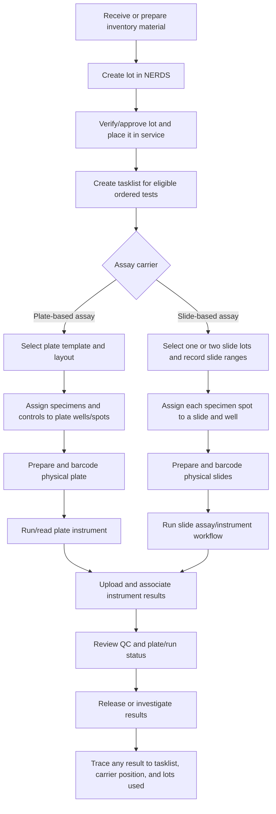

# Lots, Plates, and Slides in NERDS

## Purpose

NERDS uses these three terms to track different parts of an assay run:

| Term | What it identifies | Primary purpose |
| --- | --- | --- |
| **Lot** | A manufactured or prepared batch of inventory material | Traceability and quality control |
| **Plate** | A physical microplate used in a tasklist run | Organizing and processing specimens by well/spot |
| **Slide** | A physical multi-well assay slide used in slide-based testing | Running and locating specimens in slide wells |

They are related, but they are not interchangeable:

- A **lot** answers: *Which batch of material was used?*
- A **plate** answers: *On which microplate and at which plate position was the specimen processed?*
- A **slide** answers: *On which slide and in which slide well was the specimen processed?*

## Plate versus slide: the explicit difference

Both plates and slides are physical assay carriers that hold multiple specimen positions. The difference is the assay workflow for which they are used.

### Assay carrier

An **assay carrier** is the physical item that holds the specimen while the laboratory test is performed. It provides the defined wells or spots where specimens, controls, and reagents are placed, incubated, and read.

In NERDS, the assay carrier is usually:

- A **microplate** for a plate-based assay
- A **multi-well microscope slide** for a slide-based assay, such as IFA

The carrier is not a reagent or a lot. It is the physical surface or container that gives a specimen its run location, such as **Plate 2, well B7** or **Slide 2, well 7**.

| Feature | Plate | Slide |
| --- | --- | --- |
| Physical carrier | A microplate, commonly with 96 wells/spots | A multi-well microscope slide |
| Assay workflow | Plate-based testing | Slide-based testing, including IFA workflows |
| NERDS location record | Plate number and plate well/spot | Slide number and slide well |
| Key setup records | Plate template/layout, pipetting scheme, plate barcode | Slide lot(s), slide range(s), slide barcode(s), and slide/well assignments |
| Typical question answered | Which plate position processed this specimen? | Which slide and well processed this specimen? |

**A plate is not a slide.** Choose the carrier required by the assay. NERDS tracks specimens on plates for plate-based runs and on slides for slide-based runs.

### Plain-language rule

- **IFA uses slides.** IFA is a slide-based assay, so specimens are processed in wells on multi-well microscope slides.
- **A plate assay uses plates.** Specimens are processed in wells or spots on a microplate, commonly a 96-well plate.

Both are assays, meaning laboratory test procedures, but they use different physical carriers and therefore follow different NERDS tasklist workflows.

## Coordinates for wells and specimen positions

### Plate coordinates

A plate location normally combines the **plate number** within the tasklist and the **well or spot identifier** on that plate.

For a standard 96-well plate, the wells are conventionally arranged as:

- Rows `A` through `H`
- Columns `1` through `12`
- A coordinate written as row followed by column, for example `A1`, `B7`, or `H12`

Example: **Plate 2, well B7** identifies the specimen position in row B, column 7 of the second physical plate in the tasklist.

NERDS stores a well identifier for each specimen/pipetting spot and maps it to the tasklist plate. The exact identifier is defined by the applicable plate layout, pipetting scheme, and instrument file. Some workflows may use special configured positions or labels for controls, so the tasklist layout is the authoritative source for that run.

### Slide coordinates

A slide location combines two numbers:

```text
slide number, well number
```

Example: **`2,7`** means the specimen is on **slide 2**, **well 7**. If an assay uses 8 wells per slide, the first eight assigned positions can be represented as `1,1` through `1,8`; the next position is `2,1`.

NERDS assigns these slide/well coordinates using the test's configured number of wells per slide. The slide number distinguishes the physical slide, while the well number identifies the specimen's position on that slide.

## What IFA means

**IFA** stands for **immunofluorescence assay**. It is a laboratory method that detects antibodies or antigens by using fluorescent labels. After the assay steps are performed, the slide is read with an appropriate fluorescence microscope or instrument and the fluorescence pattern or intensity is interpreted.

In NERDS, IFA is a slide-based workflow: the system records the physical slides, their wells, their barcodes, and the lot(s) from which the slides came. This makes each IFA result traceable to both its specimen location and the materials used.

## 1. Lot: the traceable batch of material

A lot is an individual batch of inventory. Depending on the assay, it can represent a reagent, control, assay component, or the batch of slides used for a slide-based assay.

NERDS records information such as:

- Unique lot number
- Inventory item to which the lot belongs
- Expiration date
- In-service status
- Approval, verification, and lot-to-lot approval status
- Associated controls, target values, and applicable NERDS tests

### How a lot is used

Before a lot can normally be selected for a tasklist, it must be in service and valid for the applicable test. During tasklist setup, NERDS records the selected lot(s), making it possible to trace a result or investigation back to the exact materials used.

For a slide assay, NERDS can record **Slide Lot 1** and, when needed, **Slide Lot 2**. The slide ranges for these lots must be contiguous: Slide Lot 2 begins with the slide immediately after the final slide assigned to Slide Lot 1.

### Reagent

A **reagent** is a laboratory material added to a specimen or assay carrier to make a test reaction happen or detectable. Reagents can bind to a target, wash away unbound material, control reaction conditions, or generate a measurable signal.

Examples include antibodies, conjugates, buffers, substrates, wash solutions, and controls. A reagent is the type of material; its **lot** identifies the specific manufactured or prepared batch of that material used in a tasklist.

### Conjugate lot

A **conjugate lot** is the lot number of the conjugate reagent used in an assay. A conjugate is a reagent that combines a binding molecule, commonly an antibody, with a detectable label such as a fluorescent dye. In an IFA workflow, it binds to the target at the specimen location and provides the fluorescent signal used for interpretation.

NERDS records the conjugate lot during slide setup so an IFA result can be traced to both the slide-material lot and the particular labeled reagent batch used to generate its signal.

## 2. Plate: the microplate for a tasklist run

A plate is the physical microplate used to process a set of specimens. In NERDS, a tasklist can contain one or more plates. Each tasklist plate has:

- A plate number within the tasklist
- A number of specimen spots, typically 96
- A plate layout and, where applicable, a pipetting scheme
- The specimens assigned to its wells/spots
- A plate barcode
- A plate pass/fail result and the user/date that recorded it

### How a plate is used

1. NERDS creates a tasklist from eligible ordered tests, controls, the selected lot, and a plate template/layout.
2. Specimens are assigned to plate wells or spots according to the layout and pipetting scheme.
3. The physical plate is prepared and identified by its barcode.
4. The instrument processes or reads the plate.
5. NERDS associates uploaded instrument results with the tasklist name or an allowed plate barcode.
6. Plate-level review records whether the plate passed or failed before results progress.

The plate is therefore the **run container** for plate-based work. It holds many specimen positions; it is not the same as the material lot used in the run.

## 3. Slide: the multi-well carrier for slide-based assays

A slide is a physical assay carrier that has multiple wells. NERDS uses slides for slide-based workflows, including IFA-style setup steps. Each specimen pipetting spot is assigned a location expressed as:

```text
slide number, well number
```

For example, `2,7` means the specimen is on the second slide in well 7.

NERDS stores:

- The slide number and well for each assigned specimen spot
- The number of wells per slide configured for the test
- The barcode for each physical slide
- The selected slide lot(s)
- The consecutive slide-number range supplied by each slide lot

### How a slide is used

1. A tasklist identifies the specimens and their pipetting spots.
2. NERDS assigns each spot to a slide and well based on the test's wells-per-slide configuration.
3. During slide setup, staff record the slide lot(s), slide range(s), required reagent lots, instrument, plate barcode, and slide barcodes.
4. NERDS validates slide barcodes against the tasklist using sequential values such as `<tasklist name>_01`, `<tasklist name>_02`, and so on.
5. The assay is run and results remain traceable to the slide/well position and the slide-material lot.

## End-to-end lab process



## Example

For a slide-based tasklist:

- **Conjugate lot:** `CONJ-2026-041`
- **Slide Lot 1:** `SLD-2026-118`, slides 1 through 4
- **Slide Lot 2:** `SLD-2026-119`, slides 5 through 6
- **Specimen A:** slide 1, well 1
- **Specimen B:** slide 1, well 2
- **Specimen Z:** slide 6, well 8

### How to read the example

Read the information in two layers: **materials used** and **where specimens were placed**.

| Information | Meaning |
| --- | --- |
| `Conjugate lot: CONJ-2026-041` | One batch of fluorescent conjugate reagent was used for this run. |
| `Slide Lot 1: SLD-2026-118, slides 1 through 4` | Physical slides 1, 2, 3, and 4 came from slide-material batch `SLD-2026-118`. |
| `Slide Lot 2: SLD-2026-119, slides 5 through 6` | Physical slides 5 and 6 came from a different slide-material batch, `SLD-2026-119`. |
| `Specimen A: slide 1, well 1` | Specimen A was placed in well 1 on physical slide 1. Its slide came from lot `SLD-2026-118`. |
| `Specimen B: slide 1, well 2` | Specimen B was placed in well 2 on the same slide and from the same slide lot. |
| `Specimen Z: slide 6, well 8` | Specimen Z was placed in well 8 on physical slide 6. Its slide came from lot `SLD-2026-119`. |

For example, if Specimen Z has an unusual result, NERDS shows that it used **conjugate lot `CONJ-2026-041`**, was in **slide 6, well 8**, and was processed on a slide from **slide lot `SLD-2026-119`**.

This captures both levels of traceability:

1. **Material traceability:** which conjugate and slide-lot batches were used.
2. **Run-position traceability:** exactly where each specimen was placed and processed.

## Practical interpretation

Use **lot** when documenting the material batch, **plate** when documenting a microplate-based run, and **slide** when documenting the individual multi-well slide carrier and its specimen positions. A tasklist brings these records together so NERDS can support setup, result association, QC review, and retrospective investigation.
