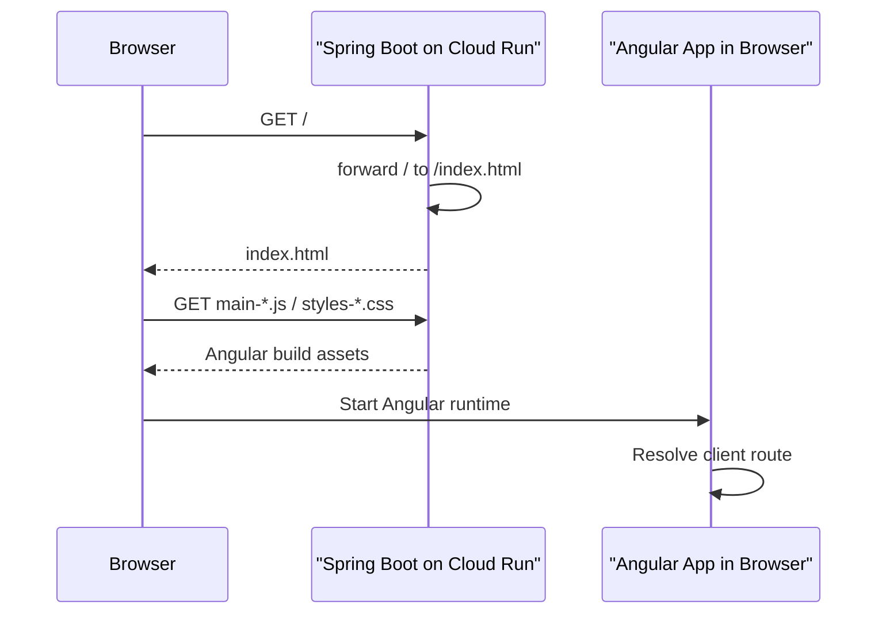
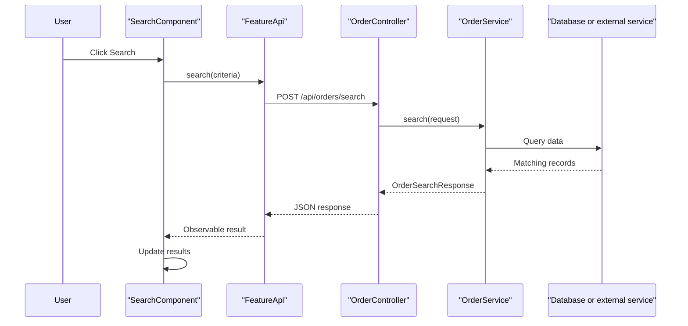

# Spring And Angular MVC Flow

## Purpose

This document explains how request flow works in this app across both sides:

- Spring Boot / Spring MVC on the backend.
- Angular routing, components, templates, and services in the browser.

The app is not a pure server-rendered MVC application. Spring Boot serves APIs
and the Angular static files. Angular owns the interactive UI after the browser
loads `index.html`.

## Big Picture

There are two routing systems working together:

```text
Spring MVC routing   Server-side routing for APIs and static files
Angular routing      Browser-side routing after Angular has started
```

The easiest mental model:

```text
Spring Boot gets the browser into the app.
Angular runs the app once it is in the browser.
Spring Boot handles backend API calls from Angular.
```

## What MVC Means On The Spring Side

Spring MVC is the backend HTTP framework.

For backend APIs, the flow is:

```text
HTTP request
Spring Security filter chain
Spring MVC controller
Service/business logic
Model/DTO response
JSON response
```

Example:

```text
POST /api/orders/search
SecurityConfig decides whether the request is allowed
OrderController.search(...) receives the request body
OrderService runs the business logic
OrderSearchResponse is returned as JSON
```

In this app, Spring's "View" layer is mostly not server-rendered HTML. The
browser UI is Angular. Spring returns JSON for APIs and serves Angular's static
files for the frontend.

## What MVC Means On The Angular Side

Angular is component-based rather than classic MVC, but the idea maps closely:

```text
Template HTML       View
Component TS        UI controller and local state
Service/API class   Data access and backend communication
TS interfaces       Frontend data models
Router              Browser-side page selection
```

For a feature page:

```text
Feature routes choose a component for /orders/search
component.html renders the page
component.ts handles user interaction and page state
FeatureApi calls backend endpoints with HttpClient
feature.models.ts defines request/response shapes
```

## Initial Page Load

When a user opens the app root:

```text
Browser requests /
Cloud Load Balancer sends request to Cloud Run
Spring Security allows static/frontend entry behavior
MVCResourceConfig forwards / to /index.html
Spring serves classpath:/static/index.html
Browser reads the JavaScript and CSS filenames from index.html
Browser requests main-*.js, styles-*.css, and chunk-*.js
Spring serves those static files
Angular starts in the browser
Angular Router renders the default route
```

Mermaid view:



## Angular Deep-Link Load

An Angular route such as `/orders/search` is not a real file on the server.

If a user refreshes the browser while already on `/orders/search`, the first request
goes to Spring Boot:

```text
Browser requests /orders/search
Spring MVC does not find a backend controller for /orders/search
Spring static resource handler does not find a real static file at /orders/search
MVCResourceConfig falls back to classpath:/static/index.html
Browser loads Angular
Angular Router sees /orders/search
Angular renders the matching page component
```

This fallback is why direct links and browser refreshes work for Angular pages.

## API Call From Angular To Spring

After Angular has loaded, user interactions often call backend APIs.

For a search page:

```text
User enters search criteria
SearchComponent.search() runs
FeatureApi.search(...) sends POST /api/orders/search
Spring Security checks the request
OrderController.search(...) handles the request
OrderService searches the data source
JSON response returns to Angular
SearchComponent updates the result list
Template re-renders the page
```

Mermaid view:



## Refresh Config Flow

A page's Refresh Config button does not refresh the frontend files.

It calls:

```text
GET /api/app/metadata
```

Flow:

```text
FeatureComponent.loadMetadata()
FeatureApi.getMetadata()
AppMetadataController.metadata()
AppMetadataService.metadata()
Angular receives the latest backend configuration values
UI updates the config panel
```

This is useful after deploys or environment-variable changes because it confirms
which configuration the running backend is using.

## Security Boundaries

There are two kinds of guards:

```text
Spring Security      Real backend access boundary
Angular route guards Browser-side user experience boundary
```

Angular guards can hide or redirect pages in the browser, but they do not secure
backend data by themselves. Any API that must be protected needs Spring Security
or method-level backend authorization.

For static assets and app entry pages, `SecurityConfig` allows files such as:

```text
/*.js
/*.css
/assets/**
/static/**
```

For backend APIs, `SecurityConfig` decides which paths require login and which
paths are temporarily open for dev/test smoke testing.

## URL Naming Rule

Backend APIs should keep using an API prefix such as:

```text
/api/...
```

Angular browser routes should use application paths such as:

```text
/orders/search
/app-list/...
/resource/...
```

This keeps the server-side API surface separate from Angular's client-side page
routes. It also makes the static fallback safer and easier to reason about.

## Cache Connection

The MVC resource flow also explains the cache-header fix.

`index.html` is the Angular app shell. It points to the current hashed bundle
files. Because it changes on each frontend deploy, Spring serves it with:

```text
Cache-Control: no-store
```

Hashed Angular assets are served with long-lived immutable caching:

```text
Cache-Control: public, max-age=31536000, immutable
```

This works because Angular changes the filename when the file content changes.

## Adding A New Feature

A typical new feature follows this shape.

Backend:

1. Add DTO/model classes for request and response shapes.
2. Add a service for business logic.
3. Add a controller under `/api/...`.
4. Decide whether the endpoint requires login or can be smoke-tested in Swagger.
5. Add OpenAPI annotations when the endpoint should be visible in Swagger.

Angular:

1. Add a feature route file.
2. Add a component for the page.
3. Add a template and styles for the view.
4. Add a data-access service that calls the backend API.
5. Add TypeScript interfaces for request/response shapes.
6. Wire the feature route into `app.routes.ts`.
7. Add a menu entry if users should navigate to it from the layout.

## Debugging Checklist

If a page does not load:

- Check whether the URL is an Angular route or a backend API route.
- For Angular routes, confirm Spring is falling back to `index.html`.
- For API routes, confirm the controller path starts with `/api/...`.
- Check `SecurityConfig` if requests redirect to `/appAuthenticate`.
- Check browser DevTools Network tab for stale `index.html` or missing chunks.

If a new deploy does not appear:

- Check the response header for `/index.html`.
- Confirm it includes `Cache-Control: no-store`.
- Hard refresh once if the browser already cached old headers before the fix.
- Confirm the loaded `main-*.js` filename matches the latest deployed
  `index.html`.
